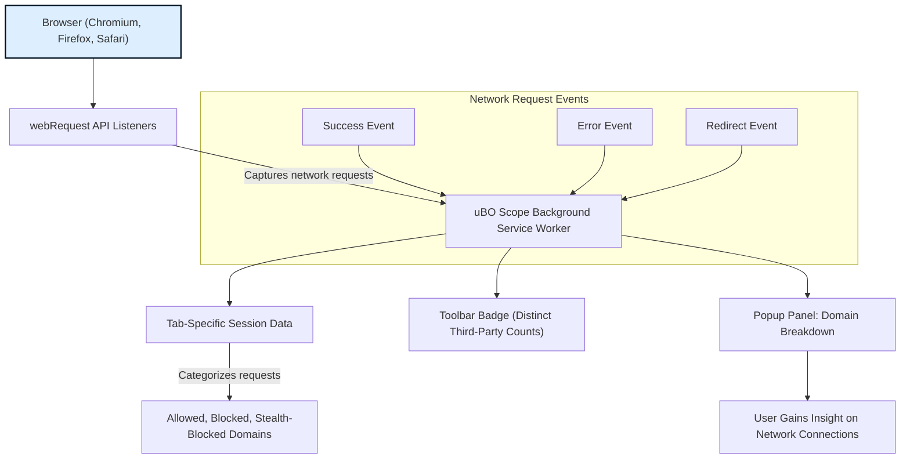

# What is uBO Scope?

## See Beyond Webpages: Understand Every Connection Your Browser Makes

uBO Scope is a lightweight, privacy-focused browser extension that reveals every attempted and successful network connection your browser makes to remote servers. Rather than treating the web as a black box, uBO Scope gives you transparent insight into third-party interactions so you fully understand who is being contacted behind the scenes of each webpage you visit.

- **Reveal all remote servers your browser connects to** — know precisely which third parties your web pages communicate with
- **Track connection outcomes** — see which requests are allowed, blocked, or stealth-blocked
- **Measure third-party prevalence** — identify how many and which remote domains are actually being contacted
- **Simple and unobtrusive interface** — the popup panel delivers clear, categorized domain data at a glance

**Ideal for:** privacy enthusiasts, filter list maintainers, security researchers, and anyone curious about the hidden web connections their browser makes.

---

## What is uBO Scope?

uBO Scope is a browser extension designed to capture and report network requests initiated by webpages, focusing on revealing the connections to remote servers. Instead of merely blocking unwanted content, uBO Scope illuminates **all** remote network activity your browser attempts or completes, including requests allowed, blocked, or redirected stealthily.

By leveraging the browser's `webRequest` API, uBO Scope listens to network events, regardless of any content blocking or DNS-level blocking in place. This means it reports the actual outcome of requests, offering unparalleled transparency to users who want to understand every third-party interaction their browser establishes.

### Core Purpose

The fundamental purpose of uBO Scope is to answer the question: _What remote servers is my browser connecting to right now, and what is the status of these connections?_ This visibility empowers users to accurately assess privacy risks, evaluate the effectiveness of content blockers, and maintain filter lists with greater confidence.

### What Makes uBO Scope Different?

- **Network Focused:** Rather than focusing on blocking, it focuses on revealing — giving an unfiltered look at network connections.
- **Outcome Transparency:** uBO Scope distinguishes between successful requests, blocked requests, and stealth-blocked ones, clarifying exactly what is happening.
- **Independent of Content Blockers:** It reports outcomes regardless of underlying content blocker strategies or DNS blocking layers.
- **Third-Party Emphasis:** Counts and categorizes distinct third-party domains contacted, making it easier to understand your network footprint.

### How It Works (High-Level)

- The browser extension registers `webRequest` API listeners for all network requests to HTTP(s) and WebSocket URLs.
- Each network event (`success`, `error`, `redirect`) updates an internal session state tracking request outcomes per browser tab.
- The extension maintains a map of domains contacted, categorized by allowed, blocked, or stealth-blocked outcomes.
- The toolbar icon badge dynamically reflects the number of **distinct third-party domains** contacted on the current tab.
- A popup panel shows detailed breakdowns of these domains, sorted by outcome category.

## Key Features of uBO Scope

### 1. Real-Time Network Connection Reporting

uBO Scope listens to browser network events and captures connection attempts as they happen, providing an accurate, live view of the remote servers requested.

### 2. Categorized Request Outcomes

Each tracked domain is classified into one of three outcome categories:

- **Allowed:** Requests that succeed and are not blocked
- **Blocked:** Requests that failed due to blocking or errors
- **Stealth-Blocked:** Requests that were redirected or modified stealthily by content blockers

This granularity aids in understanding exactly how requests are handled.

### 3. Distinct Domain Counting

Instead of counting total requests, uBO Scope counts **distinct third-party domains** contacted to highlight the actual external network footprint of a page.

### 4. Persistent Session Tracking

The extension tracks network data per browser tab and persistently stores session state. This allows continuation of monitoring and historical insight during a browsing session.

### 5. User-Friendly Popup Interface

Clicking the toolbar icon opens a popup with an intuitive display:

- The hostname and domain of the current tab
- Counts of connected domains grouped by outcome
- Lists of domains per category with counts of requests

### 6. Domain Parsing with Precision

uBO Scope leverages the Mozilla Public Suffix List to accurately identify base domains from hostnames, ensuring domain grouping is precise and meaningful.

## Why uBO Scope Matters to You

If you have ever wondered who your browser talks to behind the scenes, uBO Scope answers that question definitively. Here’s why you should care:

- **Gain absolute clarity on third-party connections:** See exactly which external domains any webpage or extension accesses.
- **Evaluate content blockers effectively:** Understand the real success of blocking by seeing actual connection attempts and outcomes.
- **Filter list maintenance:** Filter authors can use uBO Scope to verify which third parties appear and how blocking operates in practice.
- **Myth Busting:** Dispel misinformation about content blocking by examining the real network behavior rather than relying on superficial block count indicators or unreliable test pages.

Without uBO Scope, you are effectively blind to the network fingerprint of your browsing activity. 

## Getting Started with uBO Scope

### Quick Preview

Once installed, uBO Scope will immediately begin monitoring network connections in all tabs:

- Notice the toolbar icon badge count — it represents **the number of distinct third-party domains contacted** for the currently active tab.
- Click the icon to open the popup panel and get a detailed breakdown of domains contacted, grouped by outcome.

### Requirements & Compatibility

- Supported on Chromium (version 122.0+), Firefox (128.0+), and Safari (18.5+).
- Requires permissions for `activeTab`, `storage`, and `webRequest`.

### Next Steps

- Explore the [Why Use uBO Scope?](../overview/product-introduction/value-proposition) page to deepen understanding of the value provided.
- Consult [Target Audience & Use Cases](../overview/product-introduction/target-audience-use-cases) for real-world scenarios.
- Visit [Installation & Setup](../../getting-started/installation-configuration/install-ubo-scope) to add uBO Scope to your browser.

---

## Practical Tips & Best Practices

- Keep the extension enabled on sites you want full transparency on third-party communications.
- Use the popup to periodically audit network connections when browsing privacy-focused or sensitive sites.
- Consider comparing results on the same site with different content blockers enabled to see the real-world impact.
- Remember: a lower badge count indicates fewer third-party connections, which generally means better privacy.

## Common Pitfalls

- Some network requests outside the browser’s `webRequest` API scope (e.g., certain internal browser processes) will not be shown.
- The badge count reflects **distinct third-party domains**, not raw request count. A large number of requests to a single domain will show as 1.
- Stealth-blocked requests may not show as errors but are classified separately.

---

Experience browsing with complete transparency — install uBO Scope today and take control of what really happens behind the scenes on the web.

---

## References & Resources

- [uBO Scope GitHub Repository](https://github.com/gorhill/uBO-Scope)
- [Public Suffix List](http://publicsuffix.org/list/)
- Browser extension manifests for permissions and compatibility

---

## Diagram: How uBO Scope Observes Network Requests

