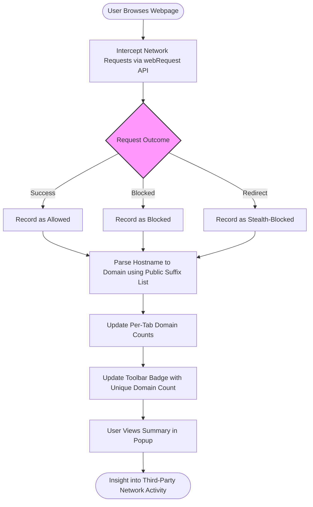

# What is uBO Scope?

## Revealing the Invisible Network Activity of the Web

Every time you load a webpage, countless network requests occur behind the scenes—some obvious, many hidden. uBO Scope is a browser extension dedicated to shining a light on these connections, specifically focusing on third-party remote servers your browser contacts, whether those connections succeed or fail.

Unlike traditional content blockers that focus on blocking ads or trackers, uBO Scope's core mission is to provide a transparent and accurate report of all network requests made by webpages you visit. This precision helps you understand exactly which third-party domains are involved in loading page content.

### Key Benefits of uBO Scope

- **Complete Transparency:** Know every connection attempt and successful remote server contact from your browser.
- **Third-Party Focus:** Concentrate on third-party domains where privacy and security risks often lie.
- **Independent Monitoring:** Works regardless of which content blockers or DNS-based blockers you use.
- **Data-Driven Insight:** Toolbar badges and popup summaries give immediate, actionable information.
- **Filter List Aid:** Helps filter list maintainers tune blocking rules based on real-world observations.

### Who Should Use uBO Scope?

- Privacy-conscious users wanting clear visibility into third-party network activity.
- Power users and filter list maintainers seeking evidence-based analysis of content blocker effectiveness.
- Developers and researchers requiring precise data on network requests beyond typical block counts.

## What Is uBO Scope?

uBO Scope is a browser extension companion tool for uBlock Origin that measures and reports network requests initiated from your browser as you surf the web. It passively listens to all outgoing network requests, categorizes them as allowed, stealth-blocked, or blocked, and attributes these to their respective domains and hostnames.

It does not itself block anything but acts as a powerful diagnostic and auditing instrument to reveal the true level of exposure your browser has to third-party servers.

### How uBO Scope Works

- Listens to browser `webRequest` API callbacks for network events.
- Captures outcomes of requests:
  - **Allowed:** Requests that reach and receive a response from remote servers.
  - **Stealth-blocked:** Requests that were silently blocked without apparent failure.
  - **Blocked:** Requests that were blocked and failed.
- Maps requests to domains and hostnames using an internal, efficient public suffix list parser to isolate registered domains.
- Maintains per-tab statistics to keep track of the number of unique third-party domains involved.

This detailed tracking empowers you to see not just raw block counts but the meaningful measure of how many unique third parties your browser contacts over time.

## Core Features & Capabilities

### 1. Comprehensive Network Request Monitoring
Tracks all network requests your browser makes to remote servers matching HTTP, HTTPS, and WebSocket protocols.

### 2. Third-Party Domain Extraction Using Public Suffix List
Uses an embedded efficient implementation of the Public Suffix List to accurately identify registrable domains from hostnames, ensuring precise accounting of third parties.

### 3. Categorization of Request Outcomes
Distinguishes between allowed, stealth-blocked, and blocked requests, providing nuanced insights to reveal stealthy blocking behavior missed by other tools.

### 4. Per-Tab Aggregation and Badge Updates
Aggregates unique domain counts per tab and dynamically updates the toolbar icon badge with the number of distinct third-party domains contacted.

### 5. Lightweight and Browser-Native
Developed as a modern extension compatible with Firefox, Chromium, and Safari, leveraging native browser APIs without intrusive behavior.

## Why Should I Care?

### Gain Visibility Where Others Obscure
Unlike blockers that only focus on ads or trackers, uBO Scope lets you uncover every third-party network contact your browser makes, even those allowed despite blocker rules.

### Assess Content Blocker Effectiveness Accurately
A common misconception is that a higher block count means better blocking. uBO Scope shifts the focus to the number of unique third-party domains allowed—which truly matters for reducing your exposure.

### Empower Filter List Development and Optimization
Filter list maintainers can use uBO Scope's data to identify blind spots, stealth blocking, and real-world request patterns, enabling smarter rule creation.

### Avoid False Confidence
Toolbars showing blocks are misleading if you don't understand the unique domain dimension. uBO Scope unpacks this complexity to keep you informed.

### Real-World Use Cases
- Diagnosing unexpected third-party connections during browsing.
- Comparing content blockers by measuring unique remote server contacts.
- Validating that stealth blocking is effectively minimizing network leakage.

## Getting Started Preview

Starting with uBO Scope is seamless:

1. **Install the extension** from your browser's official add-on store (Chrome Web Store, Firefox Add-ons, or Safari Extensions Gallery).
2. On browsing, the toolbar badge will update dynamically, reflecting the count of unique third-party domains connected to per tab.
3. Click the extension icon to open the popup, where you can explore detailed lists of allowed, stealth-blocked, and blocked domains along with their connection counts.

<u>Note:</u> To fully leverage uBO Scope, some understanding of third-party domain concepts and browser network requests enriches your insight.

Explore the related documentation sections for detailed installation guidance, UI walkthrough, and practical usage scenarios:

- [Value Proposition and Why It Matters](/overview/product-introduction/value-proposition-and-why-it-matters)
- [Target Audience & Use Cases](/overview/product-introduction/target-audience-use-cases)
- [Monitoring Third-party Connections](/guides/practical-use-cases/monitoring-3rd-party-connections)

---

## Visual Workflow of uBO Scope Operation

---

## Practical Tips

- **Focus on Domain Counts:** A lower badge count indicates fewer unique third-party connections and usually means better privacy.
- **Beware of Stealth Blocking:** Some network requests may be silently blocked. Check the 'stealth-blocked' section in the popup to identify such cases.
- **Regularly Restart Browsing Sessions:** This resets tracked data and keeps domain counts representative of current browsing.
- **Combine with uBlock Origin:** Use uBO Scope alongside uBlock Origin for both blocking and detailed monitoring.

## Common Pitfalls

- Assuming badge block counts equal effectiveness. The badge shows allowed distinct third-party domains, not block counts.
- Expecting uBO Scope to block content—it's a monitoring tool only.
- Interpreting high domain counts as inherently bad without context; some legitimate sites use multiple CDNs.

---

With uBO Scope, transparency meets precision—empowering you to see the web's true network footprint.

Start exploring your browsing connections like never before.
