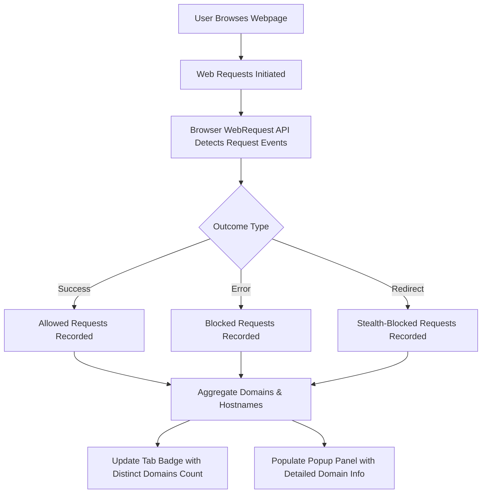

# What is uBO Scope?

## Unveiling Network Connections with Precision and Insight

uBO Scope is a lightweight, powerful browser extension crafted to illuminate the true extent of network connections initiated by web pages. Unlike typical content blockers that focus solely on counting blocked requests, uBO Scope reveals **all** connections—from those successfully completed to those that were attempted but blocked or failed. By focusing on the number of distinct third-party servers contacted, it empowers you to gain a deeper understanding of your online privacy and the effectiveness of your content blockers.

### Why uBO Scope Matters
- **Comprehensive Visibility:** See every network connection a webpage tries to make, not just what gets blocked.
- **Privacy-Centric Metrics:** Focuses on distinct third-party domains contacted rather than simple block counts, revealing true exposure.
- **Complementary Tool:** Works alongside any content blocker for an accurate evaluation of your browsing footprint.
- **Lightweight and Seamless:** Runs unobtrusively in your browser with minimal overhead.

### Designed For
- Privacy-conscious internet users seeking transparency.
- Researchers and filter list maintainers analyzing network behavior.
- Anyone curious about the real-world impact of content blocking solutions.

---

## What Is uBO Scope?

At its core, uBO Scope is an insightful monitoring extension that tracks the network requests websites initiate. It listens to your browser’s network activity to reveal which servers your browser attempts to connect with, whether or not those requests are successful.

### The Problem It Solves
Traditional content blockers often present the number of blocked requests as a measure of effectiveness, but this is misleading. Some blockers may show high block counts yet allow more distinct third-party domains, potentially exposing users more than others with lower block counts. uBO Scope redefines this measurement by counting the unique third-party servers contacted, helping users understand actual exposure and the true impact of blockers.

### What Makes uBO Scope Unique?
- **Focus on Third-Party Network Connections:** Reports the number of *distinct* third-party domains contacted rather than flat counts of blocked or allowed requests.
- **Measures All Outcomes:** Tracks successful connections, redirects, stealthy block attempts, and outright failures.
- **Resilient Data Collection:** Works regardless of the content blocker in place, capturing browser-level network events.
- **Domain-Level Aggregation:** Groups results by domain and hostname for clear insights.

---

## Key Features & Capabilities

### 1. Live Network Request Monitoring
Using your browser’s webRequest API, uBO Scope actively listens to all network requests, tracking them in real time.

### 2. Detailed Outcome Classification
Each request is categorized as:
- **Allowed (Successful):** Requests that connected successfully.
- **Blocked:** Those that failed or were blocked outright.
- **Stealth Blocked (Redirected):** Requests that were redirected or otherwise stealth-blocked.

### 3. Unique Third-Party Domain Counting
uBO Scope zeroes in on the distinct remote third-party domains contacted by web pages, disregarding repetitive hits to the same domain — a metric that directly reflects privacy exposure.

### 4. Intuitive Popup Summary Panel
Click the toolbar icon to view an organized summary:
- Total number of connected domains.
- Breakdown of allowed, blocked, and stealth-blocked domains with counts.

### 5. Badge Display with Real-Time Count
The extension icon badge dynamically displays the count of distinct third-party domains connected for the current tab, providing instant feedback on connection exposure.

### 6. Domain and Hostname Resolution
Utilizes public suffix list parsing to accurately identify base domains from hostnames, ensuring clarity when interpreting network connections.

---

## Why Should You Care?

### Understand Your Real Exposure
You gain unparalleled transparency into which remote servers your browser actually communicates with — a privacy metric rarely captured by blockers themselves.

### Avoid Misleading Metrics
Stop relying on block counts alone, which can be an ineffective or even counterproductive measure of blocker performance.

### Make Informed Decisions
Identify content blockers that genuinely reduce third-party exposure instead of artificially inflating block counts.

## Typical Use Cases
- **Privacy Audits:** Spot all third-party calls made while browsing your favorite sites.
- **Filter List Maintenance:** Validate the effectiveness of blocking rules based on connections prevented.
- **Research:** Analyze how various content blockers impact network requests under real-world browsing scenarios.

### Before and After uBO Scope
| Without uBO Scope               | With uBO Scope                                             |
|--------------------------------|-----------------------------------------------------------|
| Relies on unreliable block counts | Accurately measures distinct third-party servers contacted |
| Unaware of stealthy or failed connections | Reveals all connection outcomes including stealth-blocks and errors |
| Difficulty assessing true privacy exposure | Gains clear visibility into network behavior and exposure |

---

## Getting Started Preview

### Quick Start
Once installed, uBO Scope works quietly in the background. Browsing as usual, simply click the extension’s icon to open the popup panel and instantly see how many distinct third-party domains your current page is contacting.

### Prerequisites
- Compatible with modern browsers supporting WebExtensions API (Chrome, Firefox, Safari).
- Requires permission to monitor web requests (granted at install).

### Next Steps
- Explore detailed usage in the [Core Features at a Glance](./core-features-overview) page.
- Learn how uBO Scope fits into your privacy toolkit in [Who Should Use uBO Scope?](./target-audience-and-scenarios).

---

## How uBO Scope Works at a Glance

This simplified flow highlights how uBO Scope taps into the browser's network event system, classifies outcomes, aggregates third-party domains, and presents the data to the user.

---

## Troubleshooting & Best Practices

- **No Badge Count?**
  Ensure the page has fully loaded and network requests have occurred. Some tabs with few or no network activity will naturally show no badge.

- **Blocked Domains Count Higher Than Expected?**
  Remember, uBO Scope distinguishes between blocked and allowed connections. You want to focus on the *allowed* domains count for privacy exposure.

- **Using Multiple Content Blockers?**
  uBO Scope functions independently of content blockers and reports network outcomes regardless of blocking logic.

- **Understanding Stealth Blocked**
  Redirected requests may represent stealth blocking attempts, helping you identify subtle blocking mechanisms.

- **Interpreting Counts**
  Lower counts equal less exposure to third-party servers. Aim for aggregate allowed domains count to be as low as feasible for improved privacy.

---

## Final Thoughts
uBO Scope shines a light on your browser’s true network behavior with clarity and simplicity. It arms you with reliable data to better protect your privacy and understand the real-world impact of content blockers — going beyond surface metrics, one domain at a time.