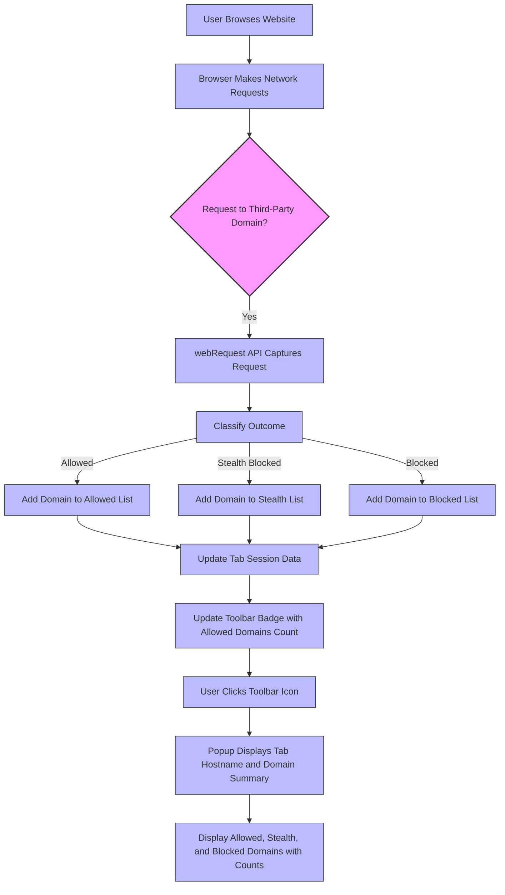

# uBO Scope in Action: Fast-Track to Insights

Experience uBO Scope from the user's perspective and quickly grasp how it delivers transparent insights on third-party network connections. This page shines a light on the core elements you'll see during usage—starting from the browser toolbar, moving to the succinct badge summary, and exploring the detailed popup interface.

---

## Instantly Understand the Toolbar Icon & Badge

When browsing, uBO Scope integrates seamlessly with your browser's toolbar by showing its icon just beside the address bar. This icon isn’t just a placeholder—it actively summarizes network activity related to the current tab.

- **The Badge Number** displays the count of *distinct third-party domains* that have successfully connected during the current webpage session. This gives you a real-time snapshot of how many unique external servers your browser communicated with.
- A *lower badge number* means fewer third-party connections, which generally correlates with better privacy and fewer tracking attempts.

This visualization helps you quickly assess the network footprint of any website you visit without diving into complex tools.

## How the Popup Summarizes Network Activity

Clicking on the uBO Scope toolbar icon opens a popup panel that breaks down third-party connections into three clear categories:

1. **Not Blocked (Allowed)**
2. **Stealth-Blocked**
3. **Blocked**

Each category lists the domains your current tab has interacted with, along with a count of network requests per domain. The interface presents this hierarchy intuitively:

- **Allowed**: These are third-party domains from which requests completed successfully and were not blocked.
- **Stealth-Blocked**: Domains for which requests were silently blocked, i.e., requests that were prevented in a manner where the page might not detect the block (commonly by uBlock Origin).
- **Blocked**: Domains where requests failed or were blocked visibly/error reported.

### Visual Breakdown of the Popup

- At the top, the popup shows the current tab's hostname and main domain, helping you confirm which page's data you’re inspecting.
- The **'domains connected'** summary count indicates how many distinct third-party domains have been observed (across the three categories).
- Each category's section lists domain names with badges showing the number of individual requests made or blocked.

### Real-World Scenario
Imagine visiting a news site:
- The toolbar badge shows “12”, indicating a dozen unique third-party domains fetched resources.
- Clicking the icon, you see: several allowed domains like content delivery networks (e.g., `cdn.example.com`), some stealth-blocked trackers, and a few domains outright blocked.
- This lets you instantly evaluate which third-parties are active and how your blocker is managing those connections.

## How uBO Scope Helps You Distinguish Between Allowed, Blocked, and Stealth

The color-coded sections and clear domain groups help you not only identify network activity but also understand its quality:

- **Allowed domains** represent connections where data was fetched, potentially exposing you to tracking or ads.
- **Stealth-blocked domains** indicate effective but subtle blocking that minimizes page breakage and prevents trackers from detecting they were blocked.
- **Blocked domains** are overt failures or blocks, which might impact page content.

This distinction empowers you to make informed decisions about your privacy, allowing you to verify how well your content blocker performs beyond generic block counts.

---

## Practical Tips & Best Practices

- **Glance at the badge number frequently** to monitor how third-party connections change as you navigate.
- Use the popup to **investigate unexpected spikes** in third-party domains — it helps identify new trackers or excessive resource loading.
- Understand that **stealth-blocking explains why some content blockers claim a low block count but still effectively prevent tracking**.
- The popup's domain counts explain if a domain is making **multiple requests**, highlighting potentially aggressive trackers or resource-heavy providers.

---

## Step-by-Step: Exploring uBO Scope in Action

<Steps>
<Step title="Open Your Browser with uBO Scope Installed">
Ensure the extension is installed and active in your preferred browser (Chrome, Firefox, or Safari).
</Step>
<Step title="Observe the Toolbar Icon">
Navigate to any website and watch the uBO Scope icon and badge — note the distinct third-party count updating live.
</Step>
<Step title="Click the Toolbar Icon to Open the Popup">
Access a detailed breakdown of all third-party domains connected during the page session.
</Step>
<Step title="Review Domain Categories">
Explore the allowed, stealth, and blocked sections to see which external domains are interacting with your browser and their request counts.
</Step>
<Step title="Apply Insights">
Use this information to guide your privacy strategy—consider adding filters or changing blocker settings when suspicious domains appear frequently in allowed or stealth lists.
</Step>
</Steps>

---

## Troubleshooting Common Issues

<AccordionGroup title="Common Popup & Badge Issues">
<Accordion title="No Data Shown in Popup">
- Ensure the extension has permissions to monitor tabs.
- Verify you have an active tab open with network activity.
- Refresh the page to trigger new network requests.
</Accordion>
<Accordion title="Badge Count Doesn't Update as Expected">
- Badge updates depend on network requests detected by browser APIs.
- Some requests outside standard protocols may not be captured.
- Disabling conflicting extensions might help.
</Accordion>
<Accordion title="Domain Names Appear as Punycode">
- This is expected for internationalized domain names; the popup converts Punycode to Unicode for display.
- If domains look unreadable, try refreshing the popup or browser.
</Accordion>
</AccordionGroup>

---

For detailed tutorials on interpreting badge counts and using the popup effectively, please visit [Reviewing Third-Party Connections with the Popup](/guides/getting-started-essentials/review-connections-popup) and [Understanding and Interpreting the Toolbar Badge Count](/guides/getting-started-essentials/understanding-badge-count).

---

### uBO Scope User Experience Overview Diagram

---