# Quick Feature Overview

## Discover uBO Scope’s Core Capabilities at a Glance

Whenever you activate uBO Scope in your browser, its power lies in how it distills complex network activity into clear, actionable insights tailored per browser tab. This page surveys the extension’s three primary features that work together seamlessly to keep you informed about the connections your web pages make.

### Why This Matters

Understanding which remote servers a webpage connects to — and whether those requests are allowed, stealth-blocked, or outright blocked — empowers you to grasp your online exposure with unparalleled clarity. uBO Scope’s popup UI delivers this insight instantly within the active tab, while badge counts and session management continuously keep you up to date.

---

## Core Features

### 1. Popup UI with Per-Tab Summaries

The popup acts as your personalized dashboard. When you click the uBO Scope toolbar icon, it presents a concise, contextual summary relating exclusively to the active browser tab:

- **Header Display:** Shows the tab’s current hostname and the registered domain it derives from.
- **Summary Section:** Reports the number of distinct third-party domains connected in that tab.
- **Outcome Sections:** Separately list domains under three categories:
  - **Not Blocked (Allowed):** Third-party domains with successful network connections.
  - **Stealth-Blocked:** Domains associated with redirect events, often invisible to the webpage.
  - **Blocked:** Domains where connection attempts failed due to blocking.

Each section breaks down connections by domain, supported by request counts that indicate frequency, helping you quickly gauge impact.

<Check>
This per-tab focus ensures you're never overwhelmed. Instead, you get laser-focused insights specifically for the webpage you are currently browsing.
</Check>

---

### 2. Toolbar Badge Count Reporting

The uBO Scope extension icon features a badge on your browser toolbar that instantly communicates the number of distinct third-party domains successfully connected to within the active tab.

- **Dynamic Updates:** The badge updates in near real-time as network requests complete.
- **Clear Significance:** Lower numbers generally indicate fewer third-party connections, which often correlates with greater privacy.
- **Visual Prompt:** With just a glance, you understand whether a page is contacting many or few external domains.

<Tip>
Remember: The badge counts only successful third-party connection domains, offering a quick snapshot of network exposure without needing to open the popup.
</Tip>

---

### 3. Session Management for Network Activity

In the background, uBO Scope maintains a detailed session mapping that tracks network requests across open tabs.

- **Tab-Specific Data:** Each tab’s network activity is separately recorded and managed internally, ensuring accurate, isolated reporting.
- **Persistent Storage:** Data is stored in session storage so it maintains continuity during your browsing session.
- **Updates on Tab Closure:** When you close a tab, its related network data is automatically cleared, keeping session data relevant and efficient.

<Info>
Behind the scenes, this session management guarantees that the popup UI and badge always reflect the freshest, most relevant information for your current browsing context.
</Info>

---

## How These Features Work Together

These features are designed to deliver a fluid user experience:

1. As you browse, uBO Scope listens to all network requests made by the active tab.
2. It categorizes connections by their outcome: allowed, stealth, or blocked.
3. The session manager aggregates this data per tab.
4. The badge count instantly tallies the number of allowed third-party domains.
5. When you open the popup, the UI displays a breakdown of domains with counts in easy-to-understand sections.

This workflow puts transparent data at your fingertips, enabling quick discovery and comprehension of complex network behaviors.

---

## Practical Example

Imagine visiting an online store:

- The badge shows ``7``, meaning seven third-party domains are successfully connected.
- Clicking the popup, you see which domains are involved: payment gateways under “not blocked,” analytics services under “stealth-blocked,” and some tracking domains under “blocked.”

This clarity helps you assess privacy exposure immediately.

---

## Best Practices & Tips

- **Check the badge frequently** to monitor how many third-party connections a webpage initiates without opening the popup.
- **Use the popup UI to drill down** and understand exactly which domains are contacted and their request frequency.
- **Pay attention to stealth-blocked domains** as they represent requests blocked or altered invisibly, often by content blockers.
- **Close tabs you no longer need** to allow session management to clean up resources and ensure data accuracy.

---

## Troubleshooting Common Issues

<AccordionGroup title="Common Troubleshooting Tips">
<Accordion title="Popup shows 'NO DATA' or remains empty">
- Ensure you have an active tab open with network requests.
- Wait a moment for the extension to process network activity, as it updates asynchronously.
- Refresh the webpage to reset network requests.
</Accordion>
<Accordion title="Badge count not updating">
- The badge updates every second; if it lags, allow some time.
- Verify uBO Scope is enabled and has the necessary permissions.
- Reload the extension or browser if persistent issues occur.
</Accordion>
<Accordion title="Data from previous tabs remains after tab closure">
- Normally, session data clears on tab close.
- If not, try restarting the browser or clearing session storage manually.
</Accordion>
</AccordionGroup>

---

## What’s Next?

Explore the [System Architecture](../architecture-and-concepts/system-architecture) page to see how these components interact internally.

Learn how to read and interpret the popup details in more depth by visiting [Reading the Popup: What Do the Numbers Mean?](../../guides/analyzing-traffic/interpreting-popup).

For new users, the [Getting Started](../../getting_started/installation_and_setup/prerequisites_and_requirements) guide offers step-by-step setup instructions to begin analyzing your browsing sessions.

---

## Links & References

- [System Architecture](../architecture-and-concepts/system-architecture)
- [Reading the Popup](../../guides/analyzing-traffic/interpreting-popup)
- [Public Suffix List](https://publicsuffix.org/)
- [Badge Count Explanation](../architecture-and-concepts/core-terms#badge-counts)

---

### Visual Summary of Feature Workflow

```mermaid
flowchart TD
    subgraph Background Session Management
        WS["Session Storage: Network Data per Tab"]
        TP["Network Requests (webRequest API)"]
        WS -->|Provides per-tab data| UPDATE["Update Badge and Popup Data"]
    end
    subgraph Popup UI
        BUTTON["User Clicks uBO Scope Icon"]
        POPUP["Show Per-Tab Summary Popup"]
        BUTTON --> POPUP
        POPUP -->|Fetches serialized tab data| WS
        POPUP -->|Displays allowed, stealth, blocked domains| USER
    end
    subgraph Badge Count
        UPDATE --> BADGE["Update Toolbar Badge per Tab"]
    end

    TP -->|Reports Network Events| WS

    style WS fill:#f9f,stroke:#333,stroke-width:2px,color:#222
    style POPUP fill:#cff,stroke:#333,stroke-width:2px,color:#222
    style BADGE fill:#fcf,stroke:#333,stroke-width:2px,color:#222
    style TP fill:#efe,stroke:#333,stroke-width:2px,color:#222

```

---

## Summary

This quick feature overview highlights the extension's popup UI with per-tab domain connection summaries, real-time toolbar badge updates reflecting distinct third-party domains connected, and robust session management that tracks and cleans up network data per tab reliably during your browsing session.

Leveraging these features, users gain immediate, actionable insight into how their browser interacts with remote third-party servers, supporting informed privacy and security awareness.

---