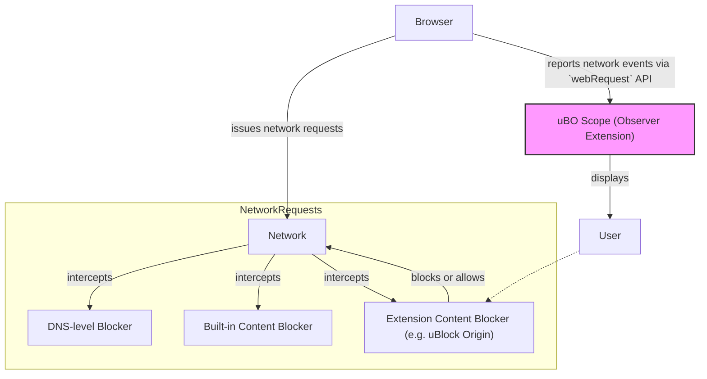

# Integrating with Content Blockers & Systems

## Unlocking Transparent Connection Reporting in the Browser

uBO Scope acts as a complementary tool to popular content blockers such as uBlock Origin and others. Unlike traditional blockers that prevent or filter network requests, uBO Scope reveals every network connection your browser attempts or completes, giving you unmatched transparency over third-party server interactions.

This page explains how uBO Scope fits alongside content blockers, detailing its integration mechanisms within browsers, highlighting its strengths and limitations compared with DNS-level or built-in blocking methods.

---

## How uBO Scope Works with Content Blockers

uBO Scope leverages the browser's `webRequest` API to observe and report all network requests made by webpages, regardless of whether another content blocker is active. It listens to every network event — requests allowed, stealth-blocked (redirected or canceled stealthily), or outright blocked — and aggregates this data by distinct third-party remote servers.

This capability means uBO Scope can operate side-by-side with blockers like uBlock Origin or any DNS-based blocklists, providing insight into what those blockers actually allow or block, in real-time.

### Why This Matters to You

- **Complete Visibility:** Know all remote servers your browser connects to, even when content blockers report blocks differently or don't show what they silently cancel.
- **Independent Verification:** Evaluate blockers by focusing on the number of distinct third-party connections rather than block counts or misleading metrics.
- **Filter List Maintenance:** If you manage or maintain filter lists, uBO Scope helps verify whether blockers are actually blocking the intended hosts.

<Check>
The toolbar badge always shows the count of distinct third-party domains successfully contacted. A lower badge count means fewer third-party connections, which is a sign of better privacy controls.
</Check>

---

## Integration Details

### An Observing Extension, Not a Blocking One

uBO Scope does not block network requests itself. It watches network events reported by browsers' `webRequest` APIs, which means:

- It captures events across all types of network traffic the browser exposes, including HTTP, HTTPS, WebSocket connections.
- It works regardless of which content blocker or DNS filtering is active, as long as network requests are visible to the browser API.
- Requests made outside the scope of the browser’s `webRequest` API (such as native apps or certain low-level DNS blocks) are **not visible to uBO Scope**.

### Browser Support & Permissions

uBO Scope’s manifests for Chromium, Firefox, and Safari specify the necessary permissions:

- `webRequest` permission to monitor network events.
- Host permissions for both `http://*/*` and `https://*/*`, and also `ws://*/*` and `wss://*/*` to cover WebSocket connections for Chromium and Firefox.

Refer to the platform manifest files (`chromium/manifest.json`, `firefox/manifest.json`, `safari/manifest.json`) for exact permission details.

---

## Strengths Compared to Other Blocking Mechanisms

| **Aspect**             | **uBO Scope**                                                     | **Built-in or DNS Blockers**                                              |
|------------------------|-----------------------------------------------------------------|---------------------------------------------------------------------------|
| Visibility             | Reports every network request outcome seen by the browser      | Does not report connections made or blocked                               |
| Integration            | Works alongside existing blockers, no interference             | Operates independently, sometimes blocks before browser sees requests    |
| Transparency           | Provides detailed insight on allowed, stealth-blocked, blocked | Mostly opaque; user rarely knows what is blocked or allowed              |
| Action                 | Observer only; no blocking or filtering                         | Directly blocks or modifies network requests                             |

### Limitations to Keep in Mind

- uBO Scope relies fully on the browser's reporting. Some requests may be invisible if the browser abstracts them away or blocks before reporting.
- DNS-level blockers stop requests before the browser can even make them; such requests won't appear unless visible to the browser.
- Because it doesn't block anything, uBO Scope is a *diagnostic and verification* tool rather than a privacy solution by itself.

---

## Real-World Example: Using uBO Scope to Understand Connection Outcomes

Imagine you have uBlock Origin enabled alongside uBO Scope:

1. You navigate to a webpage.
2. uBlock Origin blocks certain ad domains silently.
3. uBO Scope receives `webRequest` events from the browser showing which requests were allowed, stealth-blocked, or outright blocked.
4. You open uBO Scope's popup and see 3 columns:
   - **Not Blocked**: Domains the browser connected to successfully.
   - **Stealth-Blocked**: Requests that were canceled or redirected stealthily by blockers.
   - **Blocked**: Requests that were explicitly blocked by blockers.
5. The badge count on uBO Scope’s icon corresponds to the number of distinct third-party domains successfully connected.

This clear breakdown helps you confirm which trackers or third parties are actually contacted on a page, regardless of how blockers report blocks.

---

## Best Practices for Using uBO Scope with Other Blockers

- Use uBO Scope to **verify** blocker effectiveness, focusing on distinct connection counts rather than block counts.
- Avoid relying on external "ad blocker test" webpages; they create unrealistic scenarios and do not reflect actual browser connection behaviors.
- Use uBO Scope’s reports to identify overlooked legitimate third parties or overly aggressive blocking that may break websites.
- Combine insights from uBO Scope with your knowledge of filter lists to fine-tune privacy settings effectively.

<Tip>
Decreasing the number shown in uBO Scope’s badge is a strong indicator of improved privacy, as it reflects fewer third-party servers contacted.
</Tip>

<Warning>
uBO Scope cannot see or report connections initiated outside of the browser or network requests hidden from the `webRequest` API.
</Warning>

---

## Troubleshooting and Common Questions

<AccordionGroup title="Common Integration Questions">
<Accordion title="Why do some requests not appear in uBO Scope?">
Requests invisible to the browser's `webRequest` API, such as DNS-blocked requests or non-browser apps, will not be shown. The extension depends on browser-provided events.
</Accordion>
<Accordion title="Can uBO Scope block or filter connections?">
No. uBO Scope is designed solely to report network request outcomes for transparency and debugging.
</Accordion>
<Accordion title="Does uBO Scope affect the performance of my browser or blockers?">
No noticeable impact is expected since it only listens to network events without blocking or altering requests.
</Accordion>
<Accordion title="How does uBO Scope handle stealth-blocked connections?">
Stealth-blocked requests (redirected or canceled silently by blockers) appear in a separate category, making it easier to understand network behavior that other blockers might obscure.
</Accordion>
</AccordionGroup>

---

## Visualizing uBO Scope’s Role in the Content Blocking Ecosystem

This diagram illustrates how uBO Scope fits in as an observing extension receiving browser events after blockers have filtered network requests, offering the user clear visibility into what third-party connections are actually made.

---

## Next Steps

- Visit the [Feature Quick Tour](../quick-tour-integration/feature-overview) to explore uBO Scope’s popup interface and understand how to interpret its connection reports.
- Learn about [Common Myths and Misconceptions](../../realworld-usage/debunking-adblocker-myths) to better leverage tools like uBO Scope in your privacy strategy.
- For installation instructions and minimum requirements, see [Installing uBO Scope](../../installation-and-setup/installing-ubo-scope).

---

## Additional Resources

- Official repository: [uBO Scope on GitHub](https://github.com/gorhill/uBO-Scope)
- Related pages within this documentation:
  - [What is uBO Scope?](../../intro-value-audience/what-is-ubo-scope)
  - [Overall System Architecture](../../core-concepts-arch/system-architecture)
  - [Key Terms & Concepts](../../core-concepts-arch/core-terminology)

If you encounter issues or have further questions about integrating uBO Scope with content blockers, please consult the FAQs or troubleshooting chapters.

---

With uBO Scope, gain unprecedented clarity on your browser’s network activity and take control through knowledge.