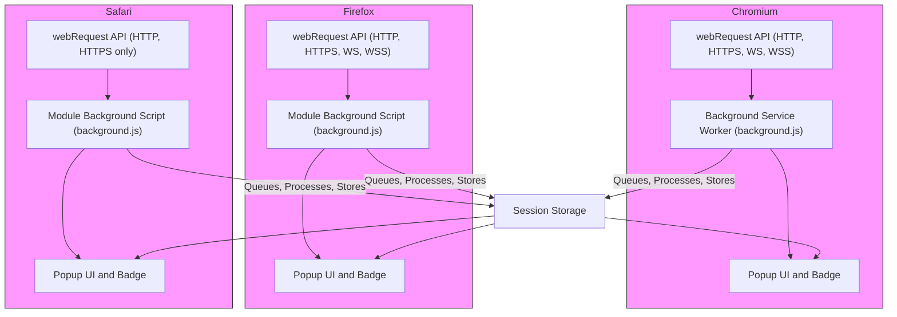

# Browser Integration & Compatibility

uBO Scope is designed to deliver reliable, insightful reporting of remote server connections across the three major browser platforms: Chromium, Firefox, and Safari. This page explains how uBO Scope integrates with each browser, highlighting how it leverages native browser APIs, coexists with other content blockers, and manages inherent technical limitations to provide users with accurate and trustworthy network connection data.

---

## How uBO Scope Integrates with Browsers

### Chromium

- **Extension Architecture**: uBO Scope runs as a Manifest v3 extension using a service worker (`background.js`) for monitoring network requests.
- **API Usage**: It employs the `webRequest` API to listen for network events (redirects, errors, successful requests) on HTTP, HTTPS, WebSocket, and secure WebSocket protocols.
- **Host Permissions**: Declares broad host permissions to cover all URLs (`http://*/*`, `https://*/*`, `ws://*/*`, `wss://*/*`), ensuring comprehensive tracking.
- **UI Integration**: The toolbar icon badge reflects the count of distinct third-party remote servers connected during browsing.

### Firefox

- **Extension Architecture**: Runs with Manifest v3 and a module-based background script (`background.js`).
- **API Usage**: Uses `webRequest` similarly to Chromium, including support for WebSocket protocols.
- **Browser-Specific Settings**: Defines unique extension ID and strict minimum version to meet Mozilla guidelines.
- **Permissions & Host Access**: Similar host and API permissions as Chromium.

### Safari

- **Extension Architecture**: Built as a Manifest v3 extension compatible with Safari's strict requirements, including a background script module.
- **Browser-Specific Settings**: Requires Safari version 18.5 or higher.
- **API Usage & Permissions**: Utilizes `webRequest` API but without WebSocket permissions due to browser limitations.
- **Popup UI and Badge**: Functions with the standard popup UI and toolbar badge like other browsers.

---

## Playing Well with Other Content Blockers

uBO Scope is specifically designed to operate *independent* of any content blocking extension’s internal mechanics. It reports *all* network requests as seen by the browser's networking layer, regardless of which content blockers are active. This provides users undeniable transparency of:

- **Allowed Connections**: Network requests that succeeded.
- **Blocked Connections**: Network requests denied, including those blocked by external filters or DNS.
- **Stealth-Blocked Connections**: Requests silently redirected or otherwise stealth-blocked.

This independence ensures uBO Scope delivers a true reflection of browser network activity instead of filtered or altered views. Users can confidently analyze third-party exposures even when multiple content blockers coexist.

---

## Browser API Limitations and Technical Constraints

Each browser imposes certain constraints which shape uBO Scope’s capabilities:

| Browser  | WebSocket Monitoring | Background Script Model | Permissions Model               | Impact on uBO Scope                      |
|----------|---------------------|------------------------|-------------------------------|----------------------------------------|
| Chromium | Yes                 | Service worker         | Manifest v3 granular hosts    | Full network visibility including WS   |
| Firefox  | Yes                 | Module background script| Strict extension ID & version | Full network visibility including WS   |
| Safari   | No                  | Module background script| Requires min version 18.5       | No WebSocket monitoring                 |

- **WebSocket Coverage**: Safari limits WebSocket monitoring due to its API restrictions, so connections using WS protocols are *not* reported there.
- **Service Worker Lifecycle**: On Chromium and Firefox, the background script runs as a service worker, meaning it can be suspended and restarted — uBO Scope handles this gracefully by queuing and batching network events.
- **Permission Granularity**: uBO Scope declares wide host permissions to gather accurate coverage, but users should be aware that these permissions are necessary to report meaningful data.

---

## How uBO Scope Ensures Reliable Reporting

- **Event Queuing and Batching**: Network request events captured via `webRequest` are queued and processed in short batches to maintain performance and ensure consistency in badge counts and popup data.
- **Tab-Specific Data Tracking**: All network connections are tracked per browser tab, so users see counts and detailed lists relevant to their current active tab.
- **Robust Domain Attribution**: Using the Public Suffix List and hostname parsing, uBO Scope correctly maps network requests to their effective domains for intuitive and accurate domain-level reporting.
- **Persistence**: Session data and the public suffix list are cached using browser storage APIs to optimize load time and reduce redundant requests.

---

## Usage Scenarios Highlighting Integration Benefits

- A user browsing with both uBlock Origin and uBO Scope gains visibility into which third-party domains are actually contacted *despite* uBlock Origin’s filtering.
- Privacy-conscious users can verify if stealth trackers are attempting connections that remain undetected by ordinary content blockers.
- Filter list maintainers benefit from consistent WebRequest APIs on Chromium and Firefox to analyze real network calls, even when other blockers alter page behavior.

---

## Practical Tips

- **Check Browser Version**: Ensure using supported browser versions for best compatibility — especially Safari 18.5 or later.
- **Understand WebSocket Gaps**: On Safari, WebSocket connection details will not appear and may affect your analysis.
- **Review Permissions Prompt**: When installing, allow broad URL access as requested for full network visibility.
- **Combine with Content Blockers**: Use uBO Scope alongside your blocker to observe indirect effects and hidden third-party connections.

---

## Troubleshooting Common Compatibility Issues

<AccordionGroup title="Troubleshooting Browser Integration">
<Accordion title="Popup Displays No Data on Safari">
If you observe the popup showing 'NO DATA' on Safari, confirm the browser version meets the minimum requirement (18.5 or newer). Also verify permissions are granted. WebSocket limitations on Safari mean some connections may not appear.
</Accordion>
<Accordion title="Badge Count Not Updating in Chromium">
Background service workers in Chromium may occasionally unload. uBO Scope queues events and processes them after a short delay; give it a moment and refresh the tab if counts are stale.
</Accordion>
<Accordion title="Conflicts with Other Extensions">
uBO Scope is designed to be compatible with other blockers but if unexpected data appears missing, temporarily disable other blocking extensions to isolate any interference.
</Accordion>
</AccordionGroup>

---

## Summary

uBO Scope’s careful cross-browser implementation ensures that users gain a consistent, actionable view of all third-party remote server connections. Understanding its integration nuances enables users to maximize value, leverage transparency when using multiple blockers, and anticipate any data variation based on browser capabilities.

For a complete start-to-finish understanding, consider exploring the following documentation:

- [Getting Started Quick Tour](../quick-tour/getting-started-overview) — How to install and first use uBO Scope.
- [How uBO Scope Works (Architecture Overview)](../core-concepts-and-architecture/how-it-works-architecture) — Internal workflow of network request monitoring.
- [Interpreting the Popup Panel: Domains and Outcomes](../../guides/effective-usage/understanding-popup-reports) — Learn how to understand the connection reports.

---

## References

- **Extension Manifests**: [Chromium Manifest](../../platform/chromium/manifest.json), [Firefox Manifest](../../platform/firefox/manifest.json), [Safari Manifest](../../platform/safari/manifest.json)
- **Source Code**: [Background Script](../../js/background.js), [Popup Script](../../js/popup.js)
- **Public Suffix List**: https://publicsuffix.org/

---

### Visual Overview of Browser Integration

---

<Check>
Ensure you use supported browser versions and grant all requested permissions to enable complete visibility of network requests. Understand browser-specific limitations like Safari’s lack of WebSocket monitoring when interpreting data.
</Check>