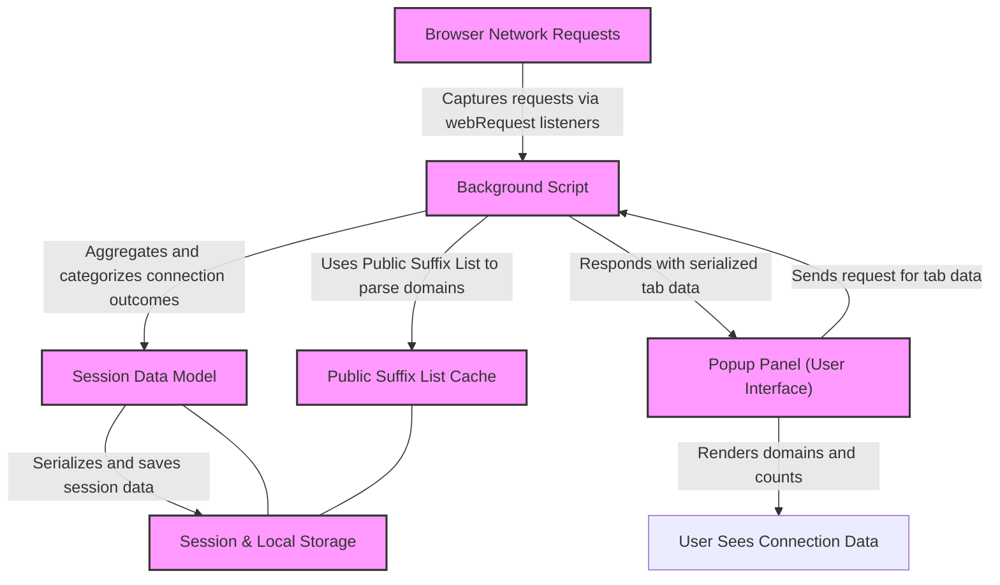

# uBO Scope Architecture (with Diagram)

Discover the internal structure of uBO Scope, the browser extension designed to unveil every network connection a webpage attempts or makes. This page offers a high-level explanation of the architecture, illustrating the roles of key components like the background script and popup panel, the communication flow, and how data is stored and processed. A comprehensive Mermaid diagram visualizes these relationships and the flow of data from network monitoring to user display.

---

## Understanding uBO Scope's Architecture

At its core, uBO Scope is built around the principle of **transparency in network activity**. Rather than merely blocking unwanted connections, it captures every connection outcome—allowed, blocked, or stealth-blocked—and provides users with meaningful insights.

This architecture balances:

- **Network-level monitoring** of requests,
- **Data aggregation and caching** in the background,
- **Interactive user interface** for real-time feedback.

### Key Components Overview

| Component       | Role & Behavior                                                |
|-----------------|---------------------------------------------------------------|
| Background Script | Acts as the central service worker/module monitoring all web requests made by active tabs. It aggregates connection data and persists session information. |
| Popup Panel      | The extension's UI that appears when clicking the browser action icon. It requests processed tab data from the background script and renders domain connection statistics in a user-friendly format. |
| Communication Layer | Facilitates message passing between the popup panel and the background script, using browser.runtime messaging APIs. |
| Data Storage    | Leverages browser session storage for caching current session data, and persistent storage for the public suffix list, enabling domain parsing and analysis. |

### Communication Flow

1. **Network Monitoring:** The background script listens for web requests and network events such as redirects, errors, and successful responses.
2. **Data Aggregation:** It categorizes these outcomes into allowed, blocked, or stealth-blocked domains and hostnames, maintaining detailed counts for the current tab.
3. **Session Persistence:** Connection data is serialized and saved into session storage to preserve state across browser restarts or session refreshes.
4. **Popup Request:** Upon user interaction, the popup panel sends a request message to the background script for the currently active tab's data.
5. **Rendering Data:** The popup receives serialized data, deserializes it, and dynamically displays the domains, their connection outcomes, and summary statistics.

### Data Handling

- **Domain Parsing:** The background script utilizes the [Public Suffix List](https://publicsuffix.org/list/) to accurately extract domains from hostnames, crucial for grouping third-party connections.
- **Data Serialization:** A custom serializer/deserializer ensures efficient communication between components without losing complex data like Maps.
- **Session Data Model:** Each tab's network connections are tracked in objects storing distinct counts of domains and hostnames per connection outcome category.

---

## Detailed Component Responsibilities

### Background Script

- Injected as a service worker or module depending on the browser platform.
- Listens to `webRequest` API events: `onBeforeRedirect`, `onErrorOccurred`, and `onResponseStarted`.
- Queues network request events into a journal, consolidating them every second for batch processing.
- For each request, it determines the connection outcome:
  - `allowed` if the request succeeded,
  - `blocked` if an error occurred,
  - `stealth` if redirected or silently blocked.
- Updates per-tab data entities with detailed domain and hostname counts.
- Maintains the badge count on the browser toolbar reflecting the number of allowed third-party domains per tab.
- Handles incoming messages from the popup, responding with serialized tab data.

### Popup Panel

- Loads on-demand when a user clicks the extension icon.
- Requests the background script for network connection details of the active tab.
- Displays:
  - The current tab's hostname and base domain,
  - Separate lists of allowed, blocked, and stealth-blocked domains with access counts,
  - A summary count of total distinct connected domains.
- Uses Unicode domain conversion (via `punycode`) to present internationalized domain names understandably.

### Data Storage and Utilities

- Uses session storage for volatile tab data ensuring data is scoped per session.
- Caches the Public Suffix List to efficiently parse domain names from hostnames.
- Employs robust abstractions for local and session storage operations to gracefully handle edge cases.

---

## Visualizing the Architecture

This diagram presents a clear step-by-step flow of information in the extension—from capturing network requests, processing and storing data, retrieving information upon user demand, and ultimately visualizing the network connection data for user insight.

---

## Practical Summary

- The **background script** is the relentless observer, capturing, interpreting, and storing network request outcomes.
- The **popup panel** is the user-facing dashboard translating raw data into actionable insight.
- The **communication backbone** efficiently bridges the background processing and the popup UI.
- **Persistent storage and the Public Suffix List** enable precise grouping and retrieval of domain information.

Together, these components offer users a **transparent and reliable window** into all remote server interactions of their active browser tabs.

---

## Tips for Users and Developers

- This architecture ensures minimal performance impact by batching network events before processing.
- The badge count reflects distinct allowed third-party domains, not blocked connections — understanding this distinction is key when interpreting results.
- Developers maintaining filters or enhancing uBO Scope can extend the session data model to incorporate more granular network information.

---

For a practical introduction to using uBO Scope and interpreting its outputs, refer to our [Getting Started guides](/getting-started).

---

[Back to Overview](../overview/introduction-and-value/what-is-ubo-scope)

[Explore Data Collection Flow](../overview/system-architecture-and-data-flow/data-collection-and-display-flow)

[Learn About Connection Types](../overview/core-concepts-and-key-ideas/domain-connection-types)

---

## Source Code References

- Background script logic: `js/background.js`
- Popup panel rendering: `js/popup.js`
- Browser extension manifest (multi-platform): `platform/chromium/manifest.json`, `platform/firefox/manifest.json`, `platform/safari/manifest.json`

<Source url="https://github.com/gorhill/uBO-Scope" paths={[{"path": "js/background.js"},{"path": "js/popup.js"},{"path": "platform/chromium/manifest.json"}]} />

---   

## Troubleshooting Common Issues

<AccordionGroup title="Troubleshooting uBO Scope Architecture">
<Accordion title="Popup Doesn't Display Connection Data">
Verify that the background script is active and properly processing web requests. Extensions with disabled or limited `webRequest` permissions may not collect data. Reloading the page or reloading the extension often helps.
</Accordion>
<Accordion title="Badge Count is Zero Despite Network Activity">
Understand that the badge counts distinct **allowed** third-party domains. Stealth blocks or certain redirects may not count. Also, ensure your browser supports the `webRequest` API fully for this extension.
</Accordion>
<Accordion title="Data Not Persisting Across Sessions">
The session data relies on browser session storage which may clear on browser exit. Persistent caching is limited to the public suffix list to maintain domain parsing accuracy.
</Accordion>
</AccordionGroup>

---

For any further help, please consult the [Troubleshooting Common Setup Issues](/getting-started/getting-to-first-results/troubleshooting-common-setup-issues) page.
