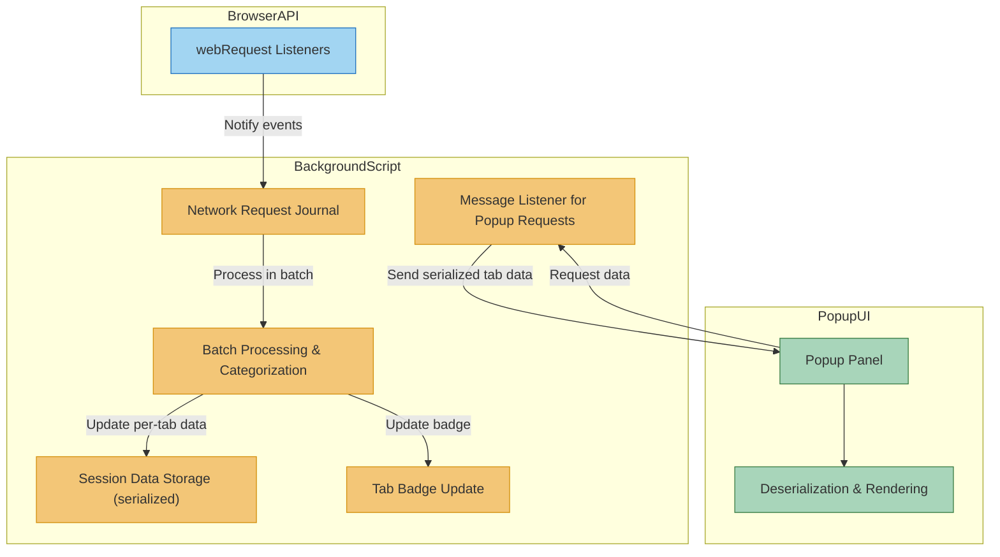

# How uBO Scope Monitors and Displays Network Activity

Discover how uBO Scope harnesses the browser's `webRequest` API to provide an unprecedented level of transparency into all network connections a webpage attempts or successfully makes. This page guides you through each stage—from capturing network events to processing, categorizing, storing, and ultimately presenting the data in a clear, user-friendly interface.

---

## Introduction

When you visit any webpage, countless network requests occur behind the scenes—some allowed, some blocked, some stealthily redirected. uBO Scope taps directly into these network events to paint a real-time picture of all remote connections, no matter what content blockers are enabled. This empowers you to better understand and trust your browsing activity.

This walkthrough explains the entire flow:

- Capturing network requests via browser APIs
- Aggregating and categorizing outcomes per browser tab
- Persisting session data securely and efficiently
- Delivering processed results to the popup UI for display

Whether you're a privacy enthusiast, developer, or filter list maintainer, this insight is critical for informed decision-making.

---

## 1. Capturing Network Requests with the Browser's webRequest API

uBO Scope leverages the `webRequest` API available in modern browsers, which permits observing network requests at different lifecycle stages. The extension listens specifically for these three key events:

- `onBeforeRedirect`: When a request is redirected to another URL
- `onErrorOccurred`: When a request fails to complete
- `onResponseStarted`: When the browser receives a response for a request

These listeners are configured using host permissions for all HTTP, HTTPS, WebSocket, and secure WebSocket URLs, ensuring comprehensive coverage of network traffic initiated by webpages.

The background service worker or script captures all these events for every active tab.

### Practical Impact

This approach guarantees that uBO Scope sees every attempted connection, including those allowed, blocked, or redirected — irrespective of whether other content blockers intervene.

## 2. Organizing Network Events into a Journal

Rather than processing each network request synchronously, uBO Scope queues captured request details into a lightweight network request journal.

This journal accumulates requests over a short interval (e.g., 1 second) to:

- Batch process network events efficiently
- Reduce UI and processing overhead

Each journal entry records critical request metadata such as:

- Tab ID (identifying which browser tab made the request)
- URL and hostname
- Request type (main_frame, subresource, etc.)
- Outcome event (`redirect`, `error`, or `success`)
- Additional data like IP and status code when available

## 3. Processing and Categorizing Request Outcomes Per Tab

Upon timer expiry, the journal entries are processed in batch. uBO Scope maintains a detailed per-tab data structure tracking:

- **Allowed** connections: Successful requests
- **Blocked** connections: Requests that failed (errors)
- **Stealth-blocked** connections: Redirected requests flagged as stealth blocking

For each request:

- The hostname and domain are extracted and normalized (using the Public Suffix List to accurately identify registrable domains).
- Connections are added to the appropriate category's aggregation maps for domains and hostnames.

If the request is for a main frame (top-level document load), uBO Scope resets previous tab data, ensuring data relevance to the current page.

This categorization supports aggregate counts by domain and prevents duplicates, allowing for precise display and badge count updates.

## 4. Persisting Data Using Serialization

To maintain state across tab switches, reloads, or extension restarts, uBO Scope serializes the entire session data:

- All tab-related connection details
- The Public Suffix List

This serialized snapshot is stored using the browser's `storage.session` API for session persistence.

When uBO Scope loads, it attempts to deserialize and restore previous session details to continue displaying accurate information without losing context.

## 5. Updating The Browser Action Badge

The badge on the browser toolbar icon dynamically reflects the number of distinct allowed third-party domains connected by the active tab.

- This count updates after processing batch network events relevant to a tab
- If zero connections exist, the badge is hidden for clarity

The badge provides at-a-glance insight into the third-party network footprint of the current webpage.

## 6. Delivering Data to the Popup Interface

When you click the uBO Scope icon, the popup UI initiates a message to the background script requesting tab-specific connection data.

The background script:

- Retrieves the serialized tab data from session memory
- Sends it back to the popup

The popup then:

- Deserializes incoming data
- Renders domains grouped into three clear categories:
  - **Not blocked (allowed)**
  - **Stealth-blocked**
  - **Blocked**

together with counts, domain names, and Unicode representation of international domains for ease of reading.

### User Experience Note

This structured display helps users immediately grasp which connections succeeded, which were blocked outright, and which were stealth-blocked — perfect for privacy-aware browsing.

## 7. Handling Tab Lifecycle Events

uBO Scope listens for tab removals to:

- Clear stored data for closed tabs
- Free memory and keep data relevant only to active sessions

## Summary Diagram of Data Flow

---

## Practical Tips & Common Pitfalls

- **Tip:** The extension updates badge counts asynchronously with a healthy delay to avoid frequent UI operations.
- **Tip:** If you observe no badge updates or stale data, ensure your browser supports the `webRequest` API fully and permissions are granted.
- **Pitfall:** Network requests initiated outside browser control (e.g., some WebRTC connections) may not be reported.
- **Tip:** Stealth-blocked requests appear as redirects internally but do not reflect as successful connections, helping filter list developers identify subtle blocking.

---

## Conclusion

uBO Scope's careful orchestration of event capturing, batch processing, and user-friendly display delivers a rare window into all web traffic behavior at the tab level. This transparency empowers you to uncover hidden network activity effortlessly, detect stealth blocking, and make confident privacy decisions.

Continue your journey by exploring [What is uBO Scope?](/overview/introduction-and-value/what-is-ubo-scope) to understand the product scope or dive into the [uBO Scope Architecture (with Diagram)](/overview/system-architecture-and-data-flow/architecture-overview) for a deeper architectural view.

---

## Additional Resources

- [Understanding Allowed, Blocked, and Stealth Connections](/overview/core-concepts-and-key-ideas/domain-connection-types)
- [Who Should Use uBO Scope?](/overview/use-cases-and-users/who-should-use-ubo-scope)

---

This page clarifies exactly how the extension transforms raw, low-level network events from the browser into actionable insights presented in the popup interface, bridging complex browser internals with meaningful user outcomes.