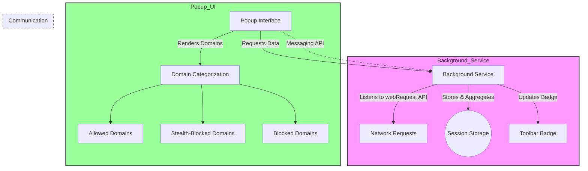

# Main Components & Their Roles

Explore the foundational elements that power uBO Scope’s ability to monitor and report network connections within your browser. This page breaks down its primary building blocks — the background service, the popup user interface, communication modules, and the style layer — and demonstrates how these pieces collaborate seamlessly to deliver real-time insights into domain categorization, session tracking, and badge updates.

---

## Introduction

uBO Scope comprises several carefully orchestrated components that together measure, categorize, and present network traffic data to the user. Understanding these core parts clarifies how the extension transforms raw network requests into actionable information displayed in the popup and toolbar badge.

This document focuses on:

- The **Background Service**: Tracks and records network connections.
- The **Popup UI**: Visually presents categorized domain data.
- The **Communication Modules**: Facilitate data exchange between components.
- The **Style Layer**: Delivers a clear, responsive interface.

---

## 1. Background Service — The Heartbeat of uBO Scope

The background script is uBO Scope’s central engine, actively listening to all network requests made by webpages and recording their outcomes.

### What It Does:

- **Monitors network events** via browser `webRequest` API listeners for redirects, errors, and successful responses.
- **Tracks connection outcomes** by categorizing hostnames and domains into **allowed**, **blocked**, and **stealth-blocked** groups.
- **Maintains session state per tab**, associating network requests with their originating browser tab for accurate reporting.
- **Aggregates and persists data** so that ongoing browsing sessions can update and reflect current network activity.
- **Updates the toolbar badge** with the count of distinct allowed domains, giving a quick visual summary of third-party connections.

### Key Implementation Details:

- **Session Data Management:** Uses in-memory maps and persistent storage (`sessionStorage`) to save tab network details and the public suffix list for domain parsing.
- **Outcome Recording:** Categorizes requests with a clear logic — e.g., main frame requests reset session data, redirects add to stealth-blocked, errors to blocked, and successful requests to allowed.
- **Domain Extraction:** Leverages the Public Suffix List for correct domain categorization, and punycode conversion ensures accurate representation of internationalized domains.

### Why It Matters:

The background service ensures that uBO Scope continuously aggregates relevant connection data without user intervention, creating a reliable and up-to-date dataset for presentation.

---

## 2. Popup UI — Visualizing Your Connection Insights

The popup is uBO Scope's interactive front end that displays the categorized network data for the active browser tab.

### What Users Experience:

- **Domain Grouping:** Domains are clearly segmented into **Not Blocked (allowed)**, **Stealth-Blocked**, and **Blocked** sections.
- **Availability of Counts:** Beside each domain, a badge indicates how many connections were observed, helping users quickly gauge the prominence of connections.
- **Real-Time Data Refresh:** Upon opening, the popup fetches the latest tab-specific data from the background component, rendering an up-to-date view.
- **Friendly Domain Names:** Uses punycode decoding to ensure international domain names are human-readable.

### How It Works:

- The UI receives serialized tab data via internal messaging.
- The JavaScript dynamically clones a row template for each domain entry, ensuring consistent layout.
- Sections with no data automatically remain hidden, keeping the interface clean.
- Responsive CSS adapts to light and dark modes, with consistent typography and spacing for readability.

### Practical User Flow:

1. User clicks the uBO Scope icon in the toolbar.
2. Popup opens and immediately shows `NO DATA` if network info is unavailable or updates to show the hostname and connected domains.
3. Domains are listed under their respective categories with counts.
4. Users can interpret the data at a glance, understanding which domains were successfully contacted and which were blocked or stealth-blocked.

---

## 3. Communication Modules — Bridging Background and Popup

Smooth interaction between the background service and the popup UI relies on a lightweight, efficient communication system.

### Communication Approach:

- **Messaging API:** The popup sends a message to request network data for the active tab.
- **Serialized Data Transfer:** To efficiently transmit complex session data structures, data is serialized before sending and deserialized upon receipt.
- **Promises and Asynchronous Operations:** Both ends use asynchronous patterns to avoid UI blocking and to ensure data integrity.

### Benefits:

- Decouples UI and background logic, allowing for modular maintenance.
- Ensures data consistency, presenting users the most current information.
- Provides a streamlined mechanism to request, receive, and render tab-specific connection information.

<CodeGroup>
```javascript
// Popup requests tab data
sendMessage({ what: 'getTabData', tabId: currentTab.id })
  .then(response => {
    const data = deserialize(response);
    renderPanel(data);
  });
```
</CodeGroup>

---

## 4. Style Layer — Crafting a Clear and Responsive Interface

uBO Scope’s popup’s CSS ensures information is accessible and visually segmented for ease of understanding.

### Highlights:

- **Readable Typography:** Uses the Inter font family with balanced weights.
- **Distinct Section Colors:** Allowed domains highlight in green tones; blocked and stealth-blocked use red shades for rapid recognition.
- **Adaptive Dark Mode:** Responds to user OS/browser dark mode preference.
- **Responsive Layout:** Popup adjusts width constraints and visibility of scrollbars ensuring usability across different screen resolutions.
- **Clean Domain Rows:** Alternating background transparency differentiates entries, making scanning easier.

### User Benefit:

Users not only get accurate data but also experience a polished interface that aids quick comprehension without clutter or distraction.

---

## Component Interaction Diagram



---

## Best Practices & Tips

- **Open the popup frequently** during browsing sessions to monitor real-time connection changes.
- **Interpret badge counts smartly:** Fewer allowed third-party domains typically signal tighter control over network connections.
- **Know the categories:** Allowed domains reflect actual connections, blocked mean actively prevented, and stealth-blocked indicate redirects or stealth interventions.
- **Refresh popup if data seems stale:** Although data updates automatically, network-heavy sessions might benefit from reopening the popup.

---

## Troubleshooting Common Scenarios

<AccordionGroup title="Troubleshooting & Common Questions">
<Accordion title="Why does the popup show NO DATA?">
If the active tab’s network data is unavailable, possibly because the tab just loaded or the background service hasn’t processed requests yet, the popup will show 'NO DATA'. Opening the popup after a few seconds usually resolves this.
</Accordion>
<Accordion title="Why is the badge count sometimes zero?">
Zero indicates no distinct allowed third-party domains have connected in the active tab. This means either no external connections or all were blocked or stealth-blocked.
</Accordion>
<Accordion title="Will the popup UI update automatically without reopening?">
Currently, the popup fetches data only on opening, so manual reopen refreshes the view. Future versions may include live updates.
</Accordion>
</AccordionGroup>

---

## Summary

The interplay of uBO Scope’s background service, popup UI, communication bridge, and polished style layer equips users with an accurate, real-time view of their browser’s network connections. This architecture ensures low overhead yet rich insights, empowering users to audit traffic and understand their browsing footprint effortlessly.

For a deeper understanding of the workflow for network requests and session data management, see the [High-Level Architecture](https://your-doc-site/overview/system-architecture-and-flow/high-level-architecture) documentation.


---

## Related Documentation & Next Steps

- [What is uBO Scope?](https://your-doc-site/overview/about-ubo-scope/product-introduction) — Introduction to the product’s purpose.
- [Understanding the Popup: Viewing and Interpreting Network Connections](https://your-doc-site/guides/getting-started-essentials/understand-popup) — User-centric guidance on popup usage.
- [Data Flow: From Web Requests to Insights](https://your-doc-site/overview/system-architecture-and-flow/data-flow-connections) — Detailed data paths and transformation.

Explore these resources to extend your knowledge and maximize the value you get from uBO Scope.

---

## Source Code References

- Background service: `js/background.js`
- Popup UI: `popup.html` and `js/popup.js`
- Stylesheet: `css/popup.css`
- Communication utilities: `js/ext.js`


<Source url="https://github.com/gorhill/uBO-Scope" paths={[{path:"js/background.js",range:"1-240"},{path:"js/popup.js",range:"1-90"},{path:"popup.html",range:"1-70"}]} />

---

*End of Main Components & Their Roles*