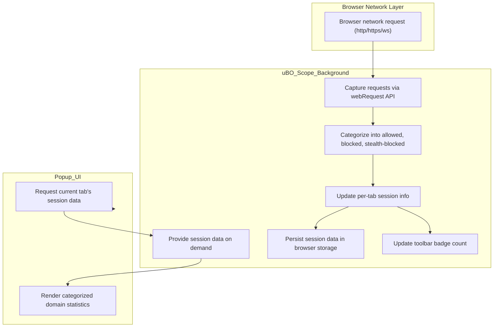

# Data Flow: From Web Requests to Insights

Discover how uBO Scope captures every network request your browser makes, organizes the data, and presents you with clear, real-time insights. This page walks you through the journey of web request data—from initial monitoring, through classification and session management, to the dynamic statistics you see in the popup interface.

---

## Introduction

Imagine browsing the web and instantly knowing which remote servers your browser connects to, which are allowed, which are blocked, and which remain stealthy. This transparency empowers you to understand your network footprint and privacy landscape.

This page describes exactly how uBO Scope achieves this seamless visibility by translating browser network events into meaningful data you can explore.

---

## The Journey of Web Requests in uBO Scope

### 1. Monitoring Network Requests

uBO Scope continuously listens to your browser's network traffic using the browser's `webRequest` API. This core capability allows it to observe:

- All HTTP and HTTPS requests (`http:`, `https:`)
- WebSocket requests (`ws:`, `wss:`)

Every request generates an event, such as:

- `success` when a request completes successfully
- `redirect` when a request is being redirected
- `error` when a request is blocked or fails

These events fuel the data collection pipeline.

### 2. Categorizing and Aggregating Outcomes

Each network request is analyzed and sorted into one of three categories:

- **Allowed:** Requests that succeeded and were not blocked
- **Blocked:** Requests that failed due to content blocking or errors
- **Stealth-blocked:** Requests that were redirected stealthily, often to bypass detection

uBO Scope keeps counts at two levels:

- **Hostnames:** The exact origins of requests, such as `ads.example.com`
- **Domains:** The broad domain names, like `example.com`, grouped using the Public Suffix List to ensure accurate aggregation

This classification and aggregation reveal patterns about which domains your browser contacts over the course of your session.

### 3. Persisting Session Information Per Tab

Network data is tracked on a per-tab basis to maintain context. This means:

- Each active browser tab has a dedicated session record storing its network outcomes
- When the main frame (top-level page) loads, the tab's previous data resets to ensure fresh context
- As sub-requests occur (scripts, images, frames), outcomes accumulate to their respective session

Session data is stored using the browser's session storage, allowing fast access while your browsing session lasts.

### 4. Surfacing Real-Time Statistics

uBO Scope synthesizes this continuously updated session data into intuitive real-time insights:

- The browser toolbar icon badge shows the number of distinct allowed third-party domains
- Opening the popup displays three distinct sections listing all domains categorized by their request outcomes
- Counts next to each domain reflect how many times your browser connected to that origin

By making this data easily visible, uBO Scope helps you audit and understand your browsing network activity effortlessly.

---

## Detailed User Flow

<Steps>
<Step title="Network Request Captured">
A web request is initiated by your active browser tab (e.g., loading a webpage or resource).
</Step>
<Step title="Event Triggered">
uBO Scope listens for network events, capturing requests, redirects, errors, and responses.
</Step>
<Step title="Outcome Determined">
Based on the network event, the request is categorized as allowed, blocked, or stealth-blocked.
</Step>
<Step title="Session Data Updated">
The domain and hostname counts are updated in the active tab's session record for each category.
</Step>
<Step title="Badge & Popup Updated">
uBO Scope updates the toolbar badge count and popup display to reflect the latest data.
</Step>
</Steps>

---

## Practical Example

Consider you are visiting a news website:

- The main page loads (`main_frame` request), starting a new tab session tracking.
- Scripts from `cdn.newsmedia.com` load successfully and are added to the allowed category.
- Ads from `ads.tracker.net` are blocked and categorized accordingly.
- Some requests redirect silently to alternate servers, marked as stealth-blocked.

Opening the uBO Scope popup then shows:

- The main page domain as the tab hostname
- The number of distinct allowed domains such as `cdn.newsmedia.com`
- Blocked domains like `ads.tracker.net`
- Any stealth-blocked domains clearly separated

This live view helps you see what your browser is connecting to and what the content blocker is doing.

---

## Tips for Success

- **Focus on the Badge Count:** The badge shows how many distinct third-party domains are allowed, an important indicator of your exposure.
- **Use the Popup Regularly:** Opening the popup for each tab gives you precise insights tied to your current browsing context.
- **Be Aware of Session Scope:** Data is reset when the main frame reloads, so refreshing the page restarts monitoring for that tab.

---

## Troubleshooting Common Issues

<AccordionGroup title="Troubleshooting Network Data Flow">
<Accordion title="Why does my badge count sometimes disappear?">
If no allowed domains are detected for a tab (e.g., during page loading or no third-party connections), the badge will appear empty.
</Accordion>
<Accordion title="What if network requests don't show in the popup?">
Ensure the extension has required permissions (`webRequest`) and is active for the site. Some browser policies or private modes may limit data capture.
</Accordion>
<Accordion title="Can session data be lost?">
Session information persists only during the life of the tab. Closing or reloading the tab resets the data.
</Accordion>
</AccordionGroup>

---

## How This Fits Into uBO Scope

This data flow underpins the core value of uBO Scope by transforming raw browser network events into user-facing insights that:

- Show real network footprints for privacy awareness
- Reveal which connections are blocked or allowed
- Support deeper investigations through the popup UI

For more about the architecture and components that make this possible, explore the [High-Level Architecture](/overview/system-architecture-and-flow/high-level-architecture) and [Components Overview](/overview/system-architecture-and-flow/components-overview).

To get started experiencing this flow first-hand, open the [Popup Usage Guide](/guides/getting-started-essentials/understand-popup).

---

## Visualization of the Data Flow

This diagram highlights the flow from your browser making a network request, through uBO Scope’s background processing to session data management and updating the UI for your insight.

---

## Next Steps

Now that you understand how uBO Scope processes network requests into meaningful data:

- Open the [Popup Interface Guide](/guides/getting-started-essentials/understand-popup) to explore how to interpret these statistics.
- Learn about common terms and categories in [Core Concepts & Terminology](/overview/about-ubo-scope/core-concepts-terminology).
- Explore how different network outcomes influence the displayed data.

Harness this knowledge to take control of your browser’s network activity and privacy footprint with confidence.

---

## References

- [High-Level Architecture](/overview/system-architecture-and-flow/high-level-architecture)
- [Components Overview](/overview/system-architecture-and-flow/components-overview)
- [Popup Usage and Interpretation Guide](/guides/getting-started-essentials/understand-popup)

---

*This document aligns with the broader uBO Scope documentation, providing targeted clarity on the data flow from web requests to user insights.*
