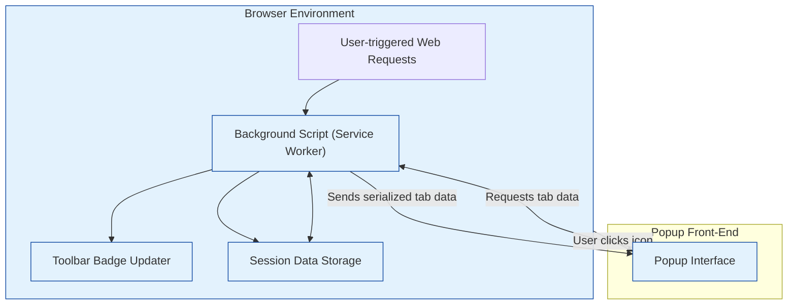

# How Does uBO Scope Work?

uBO Scope operates as a browser extension designed to transparently report the network activity generated by webpages you visit. This page explains its high-level operational workflow, focusing on how it monitors browser network requests through the background script, manages data storage, updates the browser toolbar badge, and renders the popup interface.

---

## Overview: The Extension Workflow

From the moment you load a webpage, uBO Scope actively listens to network connections initiated by the browser. It captures and categorizes these requests into three key outcome groups: allowed, blocked, and stealth-blocked. These outcomes are logged and aggregated per browser tab, enabling you to instantly see the network footprint of your browsing session through a clear badge count and detailed popup.

This process involves four core components working in concert:

- **Background Script:** Listens to network requests and records their outcomes.
- **Session Data Storage:** Maintains per-tab network activity data.
- **Badge Updater:** Displays the count of distinct allowed third-party domains on the toolbar.
- **Popup Front-End:** Presents a detailed view summarizing domains by connection outcome.

By architecting these roles distinctly, uBO Scope ensures effective monitoring with minimal performance impact while presenting actionable insights through the user interface.

---

## Detailed Workflow Description

### 1. Browser Network Monitoring via Background Script

The core of uBO Scope's observation happens in its background environment — implemented as a service worker (or background script depending on the browser). It hooks into the browser's `webRequest` API, which emits events for network activity such as request redirects, errors, and successful responses.

Each network event is queued briefly to efficiently batch-process multiple requests, maintaining an accurate journal of network connections per active browser tab.

For each observed request, uBO Scope:

- Extracts the hostname and identifies its registrable domain using the embedded public suffix list.
- Categorizes the request based on its event: `success` (allowed), `error` (blocked), or `redirect` (stealth-blocked).
- Organizes these details per-tab for ongoing aggregation.

When a tab navigates to a new page (main frame load), its previous network data resets to reflect a fresh context.

### 2. Data Storage and Session Management

All per-tab network connection details are stored in a session-scoped data structure, serialized, and saved using the browser's `storage.session` API. This approach offers:

- Persistence across page reloads within tabs.
- Isolation of network data per tab.
- Efficient saving and restoring of state to minimize data loss on background script restarts.

Additionally, the public suffix list needed for accurate domain parsing is loaded and cached similarly.

### 3. Dynamic Toolbar Badge Updating

To offer instant feedback on your browsing activity, uBO Scope updates the toolbar icon's badge text to show the number of distinct allowed third-party domains connected in the active tab. This count helps you gauge the complexity and third-party footprint of the page you are visiting.

Badge updates are triggered after batches of network requests are processed, ensuring smooth, up-to-date visual indicators.

### 4. Front-End Popup Rendering

When you click the uBO Scope toolbar icon, the extension popup renders a categorized list of domains observed for the current tab:

- **Not Blocked:** Allowed connections.
- **Stealth-Blocked:** Connections that were redirected stealthily.
- **Blocked:** Failed or blocked connections.

The popup organizes domains alongside connection counts and handles internationalized domain names transparently using punycode decoding, allowing you to see readable domain names.

This detailed breakdown empowers you to quickly analyze and understand the network behaviors imposed by your content blockers or other privacy measures.

---

## Core Component Interaction Diagram

*Figure: High-level interaction between uBO Scope components and the browser.*

---

## Practical Tips & Best Practices

- **Understand the Badge Count:** The badge reflects distinct allowed third-party domains per tab — a lower count typically indicates a more privacy-respecting page or more aggressive blocking.
- **Refresh Your Tab for Clear Context:** Reloading a page clears previous tab data in uBO Scope, ensuring current network activity is accurately reflected.
- **Use the Popup for Deep Insight:** Regularly open the popup during browsing to explore domain categorization and spotting unexpected connections.
- **Browser Support Awareness:** uBO Scope relies on the `webRequest` API and may provide different levels of detail based on browser implementation.

---

## Troubleshooting Common Issues

<AccordionGroup title="Troubleshooting uBO Scope Workflow Issues">
<Accordion title="Toolbar Badge Not Updating">
- Ensure the tab is active and the extension has necessary permissions.
- Confirm the `webRequest` API is supported and enabled in your browser.
- Reload the tab to reset data and trigger fresh monitoring.
</Accordion>
<Accordion title="Popup Shows NO DATA or Empty Sections">
- The tab may not have generated network requests yet.
- Try reloading the tab and reopening the popup.
- Check for conflicts with other extensions that may interfere with request monitoring.
</Accordion>
<Accordion title="Unexpected Domain Counts or Missing Connections">
- Some connections may occur outside the reach of the `webRequest` API (e.g., certain DNS-based blocks).
- Stealth-blocking or redirection by content blockers can affect reported statuses.
</Accordion>
</AccordionGroup>

---

## Getting Started Preview

To experience uBO Scope's workflow in action:

1. **Install the extension** compatible with your browser.
2. Browse normally and observe the badge count updating per tab.
3. Click the toolbar icon to open the popup and explore detailed domain connection categories.

For detailed installation and introductory guides, visit the [Getting Started](../../getting-started/installation-basics/installing-ubo-scope) section.

---

## Related Documentation

- [What is uBO Scope?](../about-ubo-scope/product-introduction) — Introduction, purpose, and basic usage.
- [Core Concepts & Terminology](../about-ubo-scope/core-concepts-terminology) — Definitions that help interpret network connection categories.
- [Using the Popup: Viewing and Interpreting Network Connections](../../guides/getting-started-essentials/understand-popup) — How to navigate and make sense of the popup interface.

---