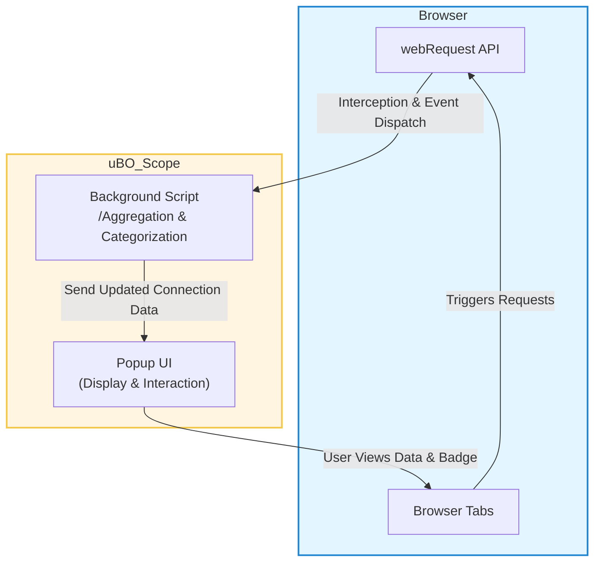

# How does uBO Scope work? (Architecture Diagram)

## Discover the Flow of Network Request Tracking

Understanding how uBO Scope operates behind the scenes will empower you to appreciate the transparency and precision it brings to revealing your browser’s network activity. This page breaks down the architectural flow of data—from the moment your browser initiates a network request, to how uBO Scope intercepts and processes that information, all the way to the user interface where you see connection details at a glance.

### The Big Picture: uBO Scope’s Workflow Explained

At its core, uBO Scope integrates seamlessly with your browser’s networking internals by using the `webRequest` API—provided by major browsers—to monitor all network requests initiated by each tab. It captures these requests regardless of any content blocker you might have enabled, ensuring you have an accurate and unblocker-bypassing view of third-party connections.

From this starting point, uBO Scope routes the data through its background scripts for processing and aggregation. Finally, the extension’s popup UI presents this data in an organized manner, grouping connections by their outcomes (blocked, stealth-blocked, allowed) and listing remote domains contacted.

<AccordionGroup title="uBO Scope Architecture Explained">
<Accordion title="Request Interception via webRequest API">

uBO Scope hooks into the `webRequest` API, a powerful browser feature that emits events for every network request initiated by the browser. This includes all HTTP(s) and WebSocket connections relevant to the active tab.

- **What happens here:**
  - Each network request is captured in near real-time.
  - Status and metadata about the request (like its third-party origin and block status) are collected.

This interception works independently from any content blocker, including DNS-layer blocking, guaranteeing accurate reporting even when some blockers stealthily modify or hide their activity.

</Accordion>

<Accordion title="Background Processing & Data Aggregation">

Once intercepted, network request events are sent to the background script (or service worker in Chromium-based browsers). This central component serves as the brain of uBO Scope.

- **Responsibilities include:**
  - Categorizing requests by their outcome: allowed, stealth-blocked, or blocked.
  - Aggregating distinct third-party domains contacted per tab.
  - Maintaining up-to-date counts for the popup badge display.
  - Managing storage to retain results as tabs update or reload.

The background script continuously updates the dataset shown to the user, ensuring it reflects a live snapshot of the browsing session’s network behavior.

</Accordion>

<Accordion title="Popup UI Display & User Interaction">

This is the face of uBO Scope that you interact with.

- **Functionality includes:**
  - Displaying the number of distinct third-party domains connected (badge count).
  - Showing the detailed list of domains grouped by their request outcome within the active tab.
  - Allowing quick identification of which connections were blocked or allowed.

Users gain instant insight into all network connections with this concise, categorized layout.

</Accordion>
</AccordionGroup>

---

### Visualizing uBO Scope’s Data Flow

This diagram clarifies each role and how data flows through the extension’s components: browser tabs initiate requests, the `webRequest` API intercepts them, the background script analyzes and groups the data, and finally the popup UI translates this information into actionable insights you can visually explore.

---

### Why Knowing This Matters

By understanding the architecture, you realize that uBO Scope provides a unique transparency layer that no content blocker alone can offer. It works in parallel to blockers without interference, precisely reporting third-party network activity while enabling quick visibility without complex tools.

This knowledge also prepares you for troubleshooting and interpreting results, ensuring you can confidently analyze connection data and spot privacy issues or overly permissive content blockers.

---

### Practical Tips for Using This Page

- Use this architectural overview when exploring how uBO Scope fits into your browser environment.
- Refer back here if you encounter unexpected results or want to understand why certain connections appear.
- Combine this insight with the [Core Concepts & Terminology](https://your-docs-url/overview/introduction-key-concepts/core-concepts-terminology) page to grasp the precise meaning of terms like 'stealth-blocked' or 'third-party remote servers'.
- Check the [Feature Summary](https://your-docs-url/overview/system-architecture-overview/feature-summary) page for how each component supports specific features you experience.

---

### Next Up: Dive Deeper or Get Started

- To start exploring network connections hands-on, see the [Quick Feature Overview](https://your-docs-url/overview/system-architecture-overview/feature-summary).
- New to uBO Scope? The [Product Overview](https://your-docs-url/overview/introduction-key-concepts/product-overview) page provides a friendly introduction.
- For practical workflows about the extension’s UI, jump to [Understanding the Popup & Badge](https://your-docs-url/getting-started/first-steps-usage/interpreting-the-popup).

---

<u>Document Version:</u> Main Branch

<u>Repository:</u> [uBO Scope GitHub](https://github.com/gorhill/uBO-Scope)

<u>Rendered UI example:</u>

---

By walking through this architectural journey, you gain confidence that uBO Scope is not only revealing but reliable and robust, ensuring you never miss third-party network activity regardless of your existing content blockers or DNS-based interventions.

---

## Troubleshooting

If you notice no or incomplete data:

- Ensure your browser supports and does not restrict the `webRequest` API.
- Verify uBO Scope has the required permissions (`activeTab`, `webRequest`, `storage`).
- Check for conflicts with other extensions or strict privacy settings that might obscure network data.

For further troubleshooting, consult the [Troubleshooting Setup Issues](https://your-docs-url/getting-started/first-steps-usage/troubleshooting-setup) page.

---

## Summary

This page provides a clear, visual understanding of how uBO Scope tracks network requests from browser tabs via the `webRequest` API, processes data in the background, and presents it in the popup for user-friendly analysis.

Armed with this understanding, users can better appreciate uBO Scope’s role, troubleshoot effectively, and leverage its insights with confidence.

---

## Related Documentation

- [What is uBO Scope? (Product Overview)](https://your-docs-url/overview/introduction-key-concepts/product-overview)
- [Core Concepts & Terminology](https://your-docs-url/overview/introduction-key-concepts/core-concepts-terminology)
- [Quick Feature Overview](https://your-docs-url/overview/system-architecture-overview/feature-summary)
- [Understanding the Popup & Badge](https://your-docs-url/getting-started/first-steps-usage/interpreting-the-popup)
- [Troubleshooting Setup Issues](https://your-docs-url/getting-started/first-steps-usage/troubleshooting-setup)

---

For direct insight into source code definitions, see the background and popup scripts in the GitHub repository:
- `/js/background.js`
- `/js/popup.js`

---

By mastering this architectural overview, you're navigating uBO Scope’s inner workings like an expert, ready to control and interpret the complex web of network connections your browser makes every moment.