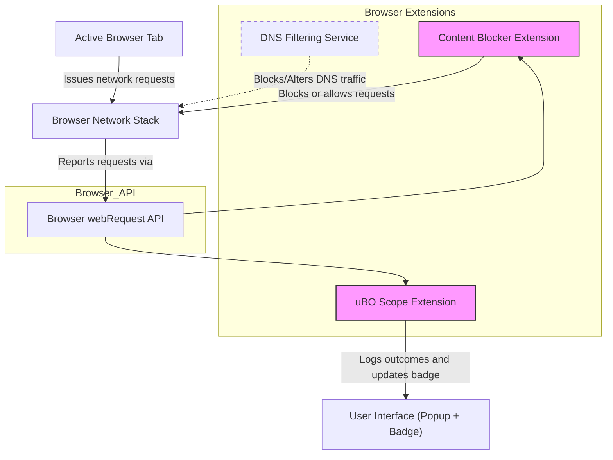

# Integration & Compatibility

uBO Scope is designed to seamlessly integrate with popular browsers and operate alongside any content blocking technique without interference or dependency overheads. This page explains how uBO Scope fits into the browser ecosystem, how it coexists with content blockers and DNS filtering, and what minimal requirements it has for smooth operation.

---

## Why Integration & Compatibility Matter

Imagine you're a privacy-conscious user or a filter list maintainer aiming to obtain accurate insights into all network connections your browser attempts. You want a tool that works transparently with whatever browser and content blocking setup you have — without breaking or being blocked itself.

That's exactly where uBO Scope shines: it integrates cleanly with leading browsers and supports any content blocking method that works with the browser's webRequest API. This ensures users always get reliable `third-party remote server connection` visibility no matter their setup.

---

## Supported Browsers and API Compatibility

uBO Scope officially supports **Chromium-based browsers**, **Mozilla Firefox**, and **Apple Safari**, adapting to each browser's specific extension APIs and manifest requirements.

- **Chromium (Chrome, Edge, etc.)**
  - Uses Manifest V3 with a service worker background script.
  - Requires Chrome 122 or newer due to API reliance.
  - Permissions include: `activeTab`, `storage`, and `webRequest`.
  - Host permissions cover HTTP, HTTPS, WS, and WSS schemes.

- **Firefox**
  - Conforms to Manifest V3 but with background module scripts.
  - Requires Firefox 128 or newer for webRequest support.
  - Also requests `activeTab`, `storage`, and `webRequest` permissions.
  - Host permissions also allow HTTP, HTTPS, WS, and WSS protocols.

- **Safari**
  - Uses background scripts declared in the manifest.
  - Requires Safari 18.5 or newer.
  - Permissions are similar but host permissions cover only HTTP and HTTPS.

> This broad compatibility means uBO Scope integrates natively with the browser extension system, leveraging standardized APIs especially the `webRequest` API, without depending on browser-specific hacks.

---

## Working Alongside Content Blockers and DNS Filters

A core strength of uBO Scope is that it accurately reports network request outcomes **regardless of which content blocker or DNS filtering service is active**. This independence ensures that the extension gives a truthful insight into all network connections attempted by the browser tab, rather than just the requests seen by a specific blocker.

### How This Works in Practice

- uBO Scope listens to the browser's `webRequest` API events: `onBeforeRedirect`, `onErrorOccurred`, and `onResponseStarted`.
- These listeners capture **all** network requests reported by the browser, even those blocked silently through DNS or content-blocking.
- By analyzing these logged events, uBO Scope classifies requests as **allowed**, **blocked**, or **stealth-blocked**.
- This classification enables users to understand the **actual network connections attempted or blocked**, beyond simplistic block counts.

### Benefits of This Compatibility

- **Transparency:** See how many third-party servers are contacted truly, not just those filtered by any one blocker.
- **Myth Busting:** Detect stealth blocking behavior common in privacy extensions or DNS filtering which some blockers hide.
- **Neutral Integration:** Works with any combination of content blockers or DNS filters without interference or needing configuration.

---

## Minimal Dependencies for Operation

To operate effectively, uBO Scope requires minimal runtime dependencies:

- **Browser WebRequest API:** The extension's core capability depends on this API to reliably monitor network requests.
- **Storage Permissions:** uBO Scope uses browser `storage.local` and `storage.session` to persist and manage session data, including hostnames and connection outcomes.
- **Host Permissions:** Inclusion of host permissions with wide patterns (`http://*/*`, `https://*/*`, `ws://*/*`, `wss://*/*`) to observe network requests across all domains.

No additional external services or APIs are needed beyond what's granted via the extension manifest and browser capabilities.

---

## Practical Tips for Integration Success

- Ensure you use a supported browser version listed above; earlier versions may not fully support the `webRequest` API or Manifest V3.
- uBO Scope can coexist with any content blocking extensions, even uBlock Origin, as it merely listens to network events without blocking or modifying requests.
- If your DNS filter blocks requests before the browser's network stack, uBO Scope will see that as a failed request and correctly classify it as blocked.
- The extension’s background process automatically manages session data, so no manual persistence or intervention is required.

---

## Summary

With robust integration into major browsers and full compatibility with any blocking mechanism utilizing the `webRequest` API, uBO Scope empowers users to achieve comprehensive visibility into their browser's network connections. It requires only minimal permissions and dependencies, ensuring a lightweight but powerful tool for understanding and auditing privacy exposure through network requests.

---

## Related Documentation Links

- [What is uBO Scope?](../introductory-concepts/about-ubo-scope) – Introduction to the product's purpose and value.
- [Core Concepts and Terminology](../introductory-concepts/core-terminology) – Essential terminology around network request outcomes.
- [How uBO Scope Works: Architecture at a Glance](./system-architecture) – High-level system workflow and network event handling.
- [Quick Feature Overview](./quick-feature-tour) – User-centric feature summary.

---

## Next Steps

Proceed to the [Getting Started](/getting-started/setup/prerequisites) page to review system requirements and supported browsers before installing uBO Scope. Installation commands and initial setup guidance follow next to enable you to unlock full browser network transparency in your environment.

---

### Mermaid Diagram: uBO Scope Integration Overview

This diagram illustrates how uBO Scope leverages the browser's webRequest API independently, working alongside other content blocking extensions and DNS filters to provide comprehensive connection visibility.
