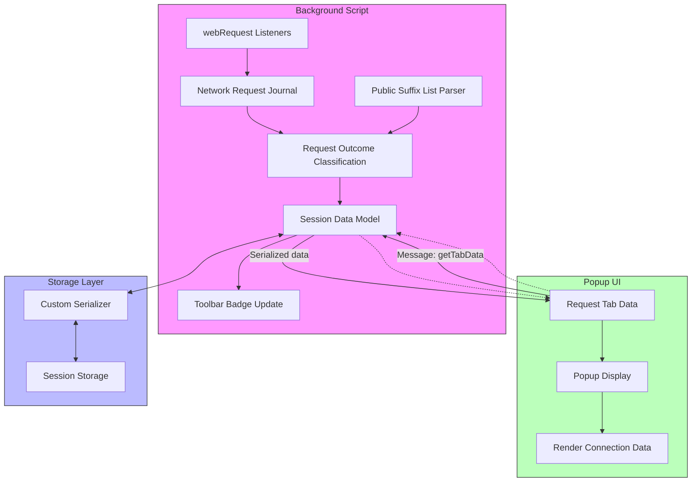

# How uBO Scope Works: Architecture at a Glance

Understanding uBO Scope’s internal architecture empowers you to appreciate how it delivers transparent, real-time insights into your browser’s network activity. This document walks you through the key components—background scripts, the popup UI, serialization mechanisms—and describes how they collaborate to track, categorize, and present network requests. Along the way, you will see how these pieces fit together to provide a seamless, user-centric experience.

---

## 1. Introduction: The Backbone of Network Tracking

At its core, uBO Scope is designed to **observe and report every relevant network request** your browser tab initiates, categorizing connections as allowed, blocked, or stealth-blocked. This is achieved through a combination of system components that operate behind the scenes and at the user interface level:

- **Background Script:** The central engine that listens to network traffic events and maintains a refined data model of these requests.
- **Popup UI:** The visible interface displaying aggregated connection statistics for the currently active tab.
- **Data Serialization & Storage:** Efficient data handling to keep session data persistent and performant.

By clearly separating concerns, uBO Scope balances complex network tracking with a streamlined user experience.

---

## 2. Background Script: The Silent Investigator

The background script (`js/background.js`) is the heart of uBO Scope's real-time data gathering:

- **Network Request Listening:** Utilizing the browser’s `webRequest` API, the extension listens to different phases of network requests (`onBeforeRedirect`, `onErrorOccurred`, and `onResponseStarted`).

- **Request Outcome Classification:** On every event, the background script determines the request’s fate—whether it was allowed, blocked, or stealth-blocked (redirected but ultimately blocked). Requests are categorized accordingly.

- **Session Management:** It maintains an in-memory session mapping (`session.tabIdToDetailsMap`) correlating each browser tab with detailed domain and hostname connection data. This includes counts of successful and blocked connections grouped by outcome.

- **Badge Update:** The extension toolbar icon’s badge count dynamically reflects the number of distinct allowed third-party domains connected from the active tab, keeping you informed at a glance.

- **Public Suffix List Integration:** It leverages a robust Public Suffix List parser to accurately extract domain hierarchies, enhancing categorization fidelity.

- **Optimized Data Handling:** Network requests are queued in a journal and processed asynchronously to reduce overhead and avoid blocking the browser’s event loop.

### Real-World Impact:

Imagine browsing your favorite news site. The background script quietly catalogs each connection attempt, capturing unnoticed third-party calls. Later, when you interact with the popup, the extension reveals these distinct connections, shining light on what happens behind the scenes.

---

## 3. Popup UI: Your Window into Network Connections

The popup interface (`popup.html` and `js/popup.js`) is the user-facing component where aggregated data becomes actionable insights:

- **Active Tab Context:** On opening, the popup automatically queries the background script for the active tab’s collected connection data.

- **Categorized Display:** Connections are organized and presented under three clear headings:
  - **Not Blocked (Allowed):** Domains successfully connected.
  - **Stealth-Blocked:** Domains where connection attempts were redirected and blocked stealthily.
  - **Blocked:** Domains whose connections failed outright.

- **Readable Domain Names:** Domain names are converted from punycode to their Unicode equivalents for easier recognition.

- **Count Badges:** Each listed domain includes the number of connection attempts, giving you granular insight.

- **Responsive Layout:** The popup dynamically adjusts to your viewport, ensuring optimal readability.

### Everyday Use Case:

You are curious about what domains your current tab connects to. Opening the popup instantly lists these domains grouped by outcome, helping you make informed decisions about your browser security and privacy.

---

## 4. Data Serialization & Session Persistence

uBO Scope efficiently serializes session data to ensure performance and persistence without bloating storage:

- **Custom Serialization:** Using a compact serializer (`lib/s14e-serializer.js`), the extension converts complex data structures like Maps into storable strings.

- **Session Storage:** Relevant session data — including tracked connections per tab — is stored using `sessionStorage` APIs (`sessionRead` and `sessionWrite` in `js/ext.js`).

- **Public Suffix List Caching:** To avoid repeated parsing on every extension startup, the processed suffix list is serialized and cached, accelerating domain extraction.

- **Smooth User Experience:** This approach maintains real-time accuracy while preserving browser and extension responsiveness.

---

## 5. Communication Flow & Component Interaction

Below is a high-level diagram depicting how the key components communicate within uBO Scope to provide real-time connection insights:

---

## 6. Practical Tips & Best Practices

- **Opening the Popup:** To analyze the current tab’s connections, just click the toolbar icon to open the popup interface.

- **Interpreting Badge Counts:** A lower badge count signifies fewer third-party remote servers connected, often correlating with enhanced privacy.

- **Understanding Domains vs. Hostnames:** Domains are extracted using the Public Suffix List to group related hostnames, providing cleaner summaries.

- **Refresh Logic:** The popup refreshes data dynamically on opening, ensuring insights are timely without manual intervention.

- **Known Limitation:** The extension only tracks network requests visible via the browser's `webRequest` API. Certain browser internals or extensions may make invisible requests.

---

## 7. Troubleshooting Common Scenarios

<AccordionGroup title="Troubleshooting uBO Scope" >
<Accordion title="No Data Displayed in Popup">
Ensure you have an active tab with network activity. If the badge and popup remain empty or show 'NO DATA', try reloading the tab. Also, verify that the content blockers or privacy features do not disable the webRequest API.
</Accordion>
<Accordion title="Badge Count Remains Stuck or Incorrect">
Background script caches counts per tab and updates asynchronously. Closing and reopening the tab or restarting the browser typically resolves stale data issues.
</Accordion>
<Accordion title="Popup Layout Breaks or Is Incomplete">
Make sure your browser supports modern CSS and JavaScript for extensions. Using the latest versions of supported browsers (Chrome, Firefox, Safari 18.5+) prevents UI glitches.
</Accordion>
</AccordionGroup>

---

## 8. Next Steps

To deepen your understanding and start leveraging uBO Scope’s full potential:

- Navigate to **[Overview / Introductory Concepts > About uBO Scope](/overview/introductory-concepts/about-ubo-scope)** for a foundational grasp of its purpose.
- Explore **[Value Propositions and Use Cases](/overview/introductory-concepts/value-prop-use-cases)** to see the extension’s impact in real-world scenarios.
- Visit **[Quick Feature Overview](/overview/system-architecture-overview/quick-feature-tour)** for detailed workflows.

Your journey begins here—equipped with architectural insights to empower smarter, more transparent browsing.

---

## References

- Source Code Repository: [https://github.com/gorhill/uBO-Scope](https://github.com/gorhill/uBO-Scope)
- Background Script Implementation: `js/background.js`
- Popup UI Files: `popup.html` and `js/popup.js`
- Public Suffix List Library: `js/lib/publicsuffixlist.js`
- Data Serialization Module: `js/lib/s14e-serializer.js`

<Source url="https://github.com/gorhill/uBO-Scope" branch="main" paths={[{"path": "js/background.js", "range": "1-125"},{"path": "js/popup.js", "range": "1-72"},{"path": "popup.html", "range": "1-40"}]} />
