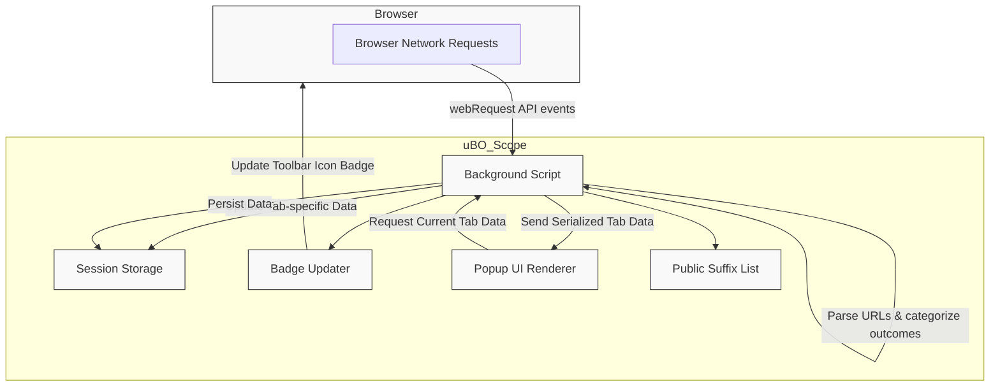

# Architecture & Data Flow

## Understanding uBO Scope’s System Architecture

uBO Scope operates as a lightweight yet powerful browser extension designed to continuously monitor and report third-party network connections initiated by webpages. This page explains the key moving parts of the extension, illustrating how uBO Scope listens to network events, organizes connection data per browser tab, presents findings through its popup interface, and updates the badge count on the toolbar icon for at-a-glance insight.

Whether you are a privacy-conscious user or a filter list maintainer, this breakdown helps you visualize uBO Scope’s inner workings to better understand how data flows from your browsing activity to meaningful metrics.

---

## Core Components & Responsibilities

- **Network Request Listener:** Using the browser’s `webRequest` API, uBO Scope intercepts all relevant network requests made by the browser. It listens for request lifecycle events such as redirects, connection errors, and successful responses, regardless of the content blocker or DNS filtering in place.

- **Tab-Level Data Aggregation:** Each browser tab’s network activity is tracked separately. The extension maintains a detailed data structure for each tab, recording which third-party domains and hostnames experienced allowed, blocked, or stealth-blocked requests.

- **Badge Update:** The browser action icon badge dynamically displays the count of distinct allowed third-party domains per tab, providing a real-time privacy exposure metric.

- **Popup Interface Renderer:** When a user opens the extension popup, detailed per-tab connection data is presented, categorized by the outcome of network requests.

- **Persistent Session Storage:** All data collected during a browsing session—including tab statistics and the public suffix list—are serialized and stored using the browser's session storage API to maintain consistency across tab updates and browser restarts.

---

## User Flow: From Network Request to Data Display

1. When a webpage initiates a network request, uBO Scope’s background script intercepts this event.
2. The extension determines the request’s URL hostname and identifies its domain using the Mozilla Public Suffix List.
3. Based on the event type (`redirect`, `error`, or `success`), the request is categorized as stealth-blocked, blocked, or allowed.
4. This outcome is recorded in a detailed per-tab data structure, tracking counts for both hostnames and domains.
5. Every second, batched records are processed to update internal session storage, and the badge count is refreshed to reflect the current allowed third-party domain exposure.
6. When a user views the popup, a message is sent to retrieve the current tab’s data, which is then parsed and rendered into a user-friendly interface showing counts grouped by connection outcome.

---

## Detailed Data Organization

uBO Scope carefully distinguishes connections on three key outcomes:

- **Allowed:** Successful network connections that were neither blocked nor stealth-blocked.
- **Blocked:** Network requests detected as failed or explicitly blocked.
- **Stealth-Blocked:** Redirected or stealthy network operations that are hidden from conventional network inspectors.

This segregation allows users to assess not only what goes through but also what is hidden or blocked behind the scenes.

### Per-Tab Data Structure

Each browser tab maintains a structured record as follows:

```json
{
  "domain": "string",
  "hostname": "string",
  "allowed": {
    "domains": Map<string, number>,
    "hostnames": Map<string, number>
  },
  "stealth": {
    "domains": Map<string, number>,
    "hostnames": Map<string, number>
  },
  "blocked": {
    "domains": Map<string, number>,
    "hostnames": Map<string, number>
  }
}
```

This format tracks counts per domain and hostname, enabling granular visibility.

---

## Visual Diagram: Architecture & Data Flow



This diagram illustrates the continuous flow from browser network events through uBO Scope’s core components to user-visible insights.

---

## Practical Insights & Tips

- **Accurate Third-Party Domain Resolution:** uBO Scope uses the Mozilla Public Suffix List combined with Punycode normalization to correctly identify registered domains from hostnames, ensuring your badge counts reflect meaningful entities rather than raw hostnames.

- **Efficient Event Handling:** To optimize performance, network request events are queued and processed in batches every second, minimizing UI lag and avoiding redundant computation.

- **Live Badge Reflection:** The badge count shows the number of distinct allowed third-party domains per tab, intuitively signaling the external exposure for the currently active webpage.

- **Persistent Session Awareness:** Session data is preserved between page reloads and even browser restarts, allowing ongoing analysis continuity.

- **Popup Details on Demand:** Opening the popup lets you inspect detailed connection outcomes, with domains grouped by allowed, stealth-blocked, or blocked, and request counts displayed.

---

## Common Pitfalls & Troubleshooting

### 1. Badge Not Updating
- **Cause:** Extensions that restrict background activity or browser profiles may delay or prevent the background script from processing network events.
- **Solution:** Ensure uBO Scope has proper permissions and the browser allows background script execution; reload the extension if needed.

### 2. Missing or Partial Data in Popup
- **Cause:** The popup fetches data from the background script; if the background script is not ready or the tab ID is incorrect, it cannot display data.
- **Solution:** Reload the webpage or switch tabs to trigger fresh data collection.

### 3. Unexpected Third-Party Counts
- **Cause:** Some legitimate third-party servers (like CDNs) naturally increase counts.
- **Solution:** Use the detailed popup view to distinguish allowed versus blocked hosts and evaluate exposure.

---

## Getting Started Preview

To begin exploring how uBO Scope reveals the network exposure of each webpage you visit:

- The extension installs a background script that hooks into the browser’s network events.
- As you browse, observe the badge count increment or decrement based on third-party connections.
- Open the popup for a categorized list of domains contacted, including allowed, stealth-blocked, and blocked, with usage counts.

Learn more about utilizing these insights in the [Step-by-Step: Monitoring Website Connections](/guides/analyzing-connections/workflow-monitoring) guide.


---

For an overview of uBO Scope’s foundational concepts, terminology, and value proposition, visit these sections:

- [Core Concepts & Terminology](/overview/system-concepts-and-architecture/core-concepts-terminology)
- [What is uBO Scope?](/overview/product-introduction-and-value/what-is-ubo-scope)
- [Value Proposition & Use Cases](/overview/product-introduction-and-value/value-proposition-and-use-cases)

---

# Source Code & Implementation Details

The background script (`js/background.js`) is the heart of the architecture. It:

- Listens to network events (`onBeforeRedirect`, `onErrorOccurred`, `onResponseStarted`) from the browser’s `webRequest` API.
- Parses request URLs to extract hostnames and determines their domains using the Public Suffix List.
- Records outcomes (allowed, blocked, stealth) into per-tab data structures.
- Batches network request events for efficient processing every second.
- Updates the toolbar badge to show the count of distinct allowed domains per active tab.
- Responds to popup requests to provide serialized tab data for detailed display.
- Persists session data via the browser’s session storage to maintain state across sessions.

The popup UI (`popup.html` and `js/popup.js`) renders this data visually, relying on the background script’s data provision.

---

By understanding this architecture, users gain confidence that uBO Scope provides accurate, timely, and actionable insights on webpage third-party network exposure—empowering smarter privacy decisions.
