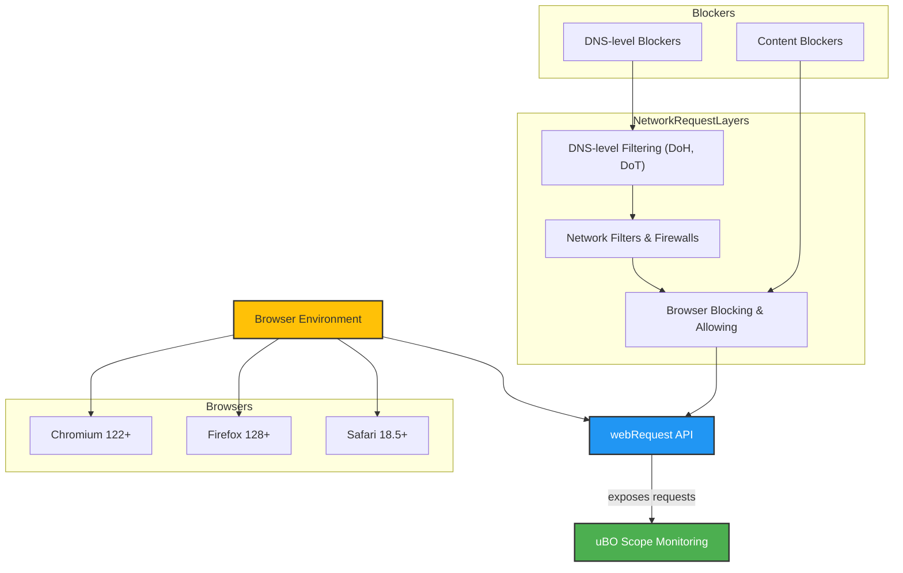

# Browser Integration & System Compatibility

uBO Scope is designed to provide transparent, reliable insight into third-party remote server connections initiated by webpages. This page offers a practical guide to understanding which browsers are supported, how uBO Scope interacts with other content blockers, and the inherent limitations of its network monitoring capabilities—especially those imposed by the browser's webRequest API.

---

## Supported Browsers

uBO Scope currently supports the following browsers:

- **Chromium-based browsers** (Chrome, Edge, Brave, etc.)
  - Minimum Chrome version: 122.0
  - Supports WebSocket (`ws://` and `wss://`) monitoring.
  - Runs as a service worker in the background.

- **Firefox**
  - Minimum Firefox version: 128.0
  - Supports WebSocket monitoring like Chromium.
  - Uses background scripts.

- **Safari** (experimental/not primary)
  - Minimum Safari version: 18.5
  - Background scripts used.
  

### How to Confirm Support

Browser support is explicitly defined in the extension's manifest files. For example, Chromium’s manifest requires Chrome 122 or later, while Firefox requires 128 or later. The extension requests permissions such as `webRequest`, `storage`, and the ability to interact with active tabs to function correctly across these browsers.

---

## Interaction with Other Content Blockers

uBO Scope does **not** block or alter network requests. Instead, it passively monitors requests reported by the browser’s webRequest API. This design allows it to:

- Work alongside any content blocker or DNS filtering solution without interference.
- Provide a true picture of outgoing network requests regardless of other blockers.
- Reveal connections that may otherwise be hidden due to stealth blocking or DNS interception.

It identifies and categorizes network request outcomes into three groups displayed in the UI:

- **Allowed**: Requests that succeeded.
- **Blocked**: Requests that the browser blocked or failed.
- **Stealth-Blocked**: Redirects or stealthy blocking events, often invisible to webpages and traditional blockers.

By capturing these events, uBO Scope offers clarity on how network requests are handled, independent of other extensions.

---

## What uBO Scope Can and Cannot Monitor

### What uBO Scope Monitors

- All network requests (requests to servers) made by webpages, including:
  - HTTP(S) requests (`http://`, `https://`)
  - WebSocket connections (`ws://`, `wss://`)

- Outcomes of network requests reported by the browser’s `webRequest` API, categorizing each as allowed, blocked, or stealth-blocked.

- Real-time third-party domain contact counts (shown as a badge) and detailed domain breakdown in the popup view.

### Limitations Related to the webRequest API

uBO Scope depends entirely on what the browser exposes via its `webRequest` API. This imposes some inherent boundaries:

- **Requests outside API visibility are not captured.** Some browsers or extensions may handle requests internally or use newer protocols that bypass or limit `webRequest` exposure.

- **Requests originating outside tabs (e.g., service workers or background processes not associated with a tab) may be underreported.**

- **Encrypted DNS (DoH/DoT) and network-level filters operate below the browser's API visibility.** Connections blocked or affected at these layers won't be reported directly by uBO Scope.

- **Webrequest API restrictions in Manifest V3 browsers.** Some browsers have reduced API capabilities for security and performance, which may affect capture fidelity.

### Impact for Users

- The badge count and popup data reflect *network requests visible to the browser’s APIs*, which correlates very closely to what webpages initiate.

- The extension will not show connections that entirely bypass the browser network stack or that are inhibited by newer privacy features beyond the webRequest scope.

- Still, for typical website browsing scenarios, uBO Scope provides one of the most comprehensive views into third-party connections.

---

## Practical Tips for Users

- **Use supported browsers with the required minimum versions** to get full monitoring capabilities.

- **Do not rely solely on uBO Scope for DNS-level blocking visibility.** Complement your setup with network-level analysis tools if you need that layer.

- If you use multiple blockers, **expect uBO Scope's counts and history to reflect the aggregate effect**, not the specifics of any one blocker.

- Occasionally, some requests may not appear due to browser-imposed API limitations; this is expected behavior, not a malfunction.

- Regularly update uBO Scope and your browsers for best compatibility and accuracy.

---

## How uBO Scope Fits into Your Workflow

By understanding its browser compatibility and integration limits, you can effectively use uBO Scope in your privacy monitoring strategy.

Imagine a typical browsing session:

1. You load a webpage with various embedded content.
2. uBO Scope observes all outbound requests visible to the browser.
3. It classifies these requests regardless of other blockers running.
4. The badge updates with the count of distinct third-party domains contacted.
5. You click the extension icon to see a detailed popup report, understanding which domains are allowed, blocked, or stealth-blocked.

This transparency aids in objectively evaluating content blocker effectiveness or identifying unexpected network activity.

---

## Summary Diagram: Browser Support & Network Visibility Boundaries

---

## Next Steps

To use uBO Scope effectively:

- Ensure you are using a supported browser version.
- Review the [Quick Feature Overview](/overview/product-introduction-and-value/quickstart-and-feature-glance) to familiarize yourself with badge and popup behavior.
- Explore [Core Concepts & Terminology](/overview/system-concepts-and-architecture/core-concepts-terminology) to deepen understanding of connection categories.
- Review the [Architecture & Data Flow](/overview/system-concepts-and-architecture/architecture-and-data-flow) for detailed insights.

Combining this knowledge allows you to confidently interpret uBO Scope's reports and troubleshoot any potential visibility gaps.

---

## Troubleshooting Common Compatibility Issues

<AccordionGroup title="Compatibility Troubleshooting">
<Accordion title="Browser Not Supported or Outdated">
If your browser version is below the minimum required, uBO Scope may not work properly, or some requests may not be visible. Update your browser to the latest stable release.
</Accordion>
<Accordion title="webRequest API Limitations">
If you notice missing requests, verify if Manifest V3 restrictions or browser privacy settings might limit webRequest API visibility. Consult your browser's documentation on extension APIs.
</Accordion>
<Accordion title="Extension Conflicts">
Using multiple extensions that modify network requests can sometimes cause unexpected behavior. Temporarily disable others if you suspect interference.
</Accordion>
<Accordion title="Safari Specifics">
Safari support is basic and may not include all features. This limitation stems from Apple's newer extension platform restrictions.
</Accordion>
</AccordionGroup>

---

For detailed insights on the practical impact of browser integration, please refer to the companion documentation pages in this section.

---

<Check>Using uBO Scope with supported browsers ensures you receive the highest fidelity network connection data possible within current browser API constraints.</Check>

<Note>uBO Scope’s unique value is transparency regardless of blocking solutions in place, but it cannot report network requests beyond its browser-level observation capabilities.</Note>
