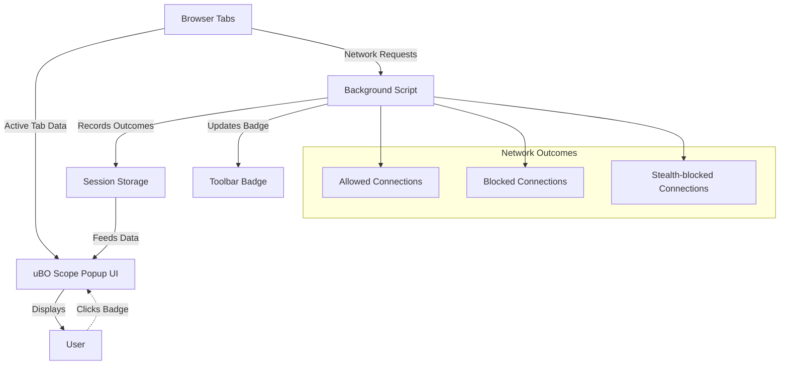

# Quick Overview of Features

Unlock the full transparency of your web connections with uBO Scope's powerful feature set. This page summarizes the core capabilities that make uBO Scope an essential companion for users seeking insight into their browser's network activity.

---

## Live Reporting of Connection Outcomes

uBO Scope continuously monitors network requests made by webpages and categorizes them into three clear outcomes:

- **Allowed:** Connections that successfully reach a remote server.
- **Blocked:** Connections prevented by content blockers or other blocking mechanisms.
- **Stealth-blocked:** Connections prevented in a way that is deliberately hidden from typical detection, showing the most stealthy level of blocking.

This immediate, categorized reporting helps you understand precisely which remote servers your browser interacts with and which are being stopped silently or explicitly.

### How This Helps You:
- Identifies all network communications your browser attempts to make.
- Reveals stealth blocking that other tools might miss.
- Enables in-depth web connection audits for privacy or debugging.

## Distinct Domain Counting and Toolbar Badge Integration

uBO Scope measures and counts the number of distinct third-party remote server domains your browser connects to on each active tab. This count is displayed prominently as a badge on the browser toolbar icon.

### Why This Matters:
- **Quick Privacy Indicator:** A lower badge count means fewer third-party connections — often desirable for better privacy.
- **Reliable Metric:** Unlike block counts alone, domain counts show the true number of separate external servers contacted.
- **Tab-Specific Feedback:** You see connection counts relevant to the active tab, allowing granular monitoring.

## Seamless Integration With Browser Popup UI

Clicking the uBO Scope toolbar icon reveals a popup UI that presents a detailed, real-time summary of domains connected under each outcome category:

- Domains not blocked (allowed)
- Domains stealth-blocked
- Domains blocked explicitly

Each domain listing includes the count of individual hostnames contacted, making it easy to scan through and identify significant network activities.

### Key UI Benefits:
- Intuitive access with no complex setup.
- Clear visual distinction between connection categories.
- Supports quick investigation of active tab connections.

## Transparency Across Content Blockers and DNS-Level Filtering

uBO Scope monitors all outgoing web requests reported by your browser’s `webRequest` API, capturing connection attempts regardless of:

- Which content blocker is active (including uBlock Origin and others).
- Blocking at the DNS level or through stealth mechanisms.

This comprehensive visibility ensures you grasp the full picture of network behavior, beyond what any single blocker UI provides.

## Cross-Browser Support

uBO Scope offers consistent functionality across major browsers including:

- Chromium-based browsers (such as Google Chrome, Microsoft Edge)
- Mozilla Firefox
- Apple Safari

Each platform’s manifest and background processes are adapted to ensure smooth operation and accurate reporting.

---

## Summarized Feature List

- **Live capture and categorization** of allowed, blocked, and stealth-blocked network connections.
- **Distinct third-party domain counting** per active tab.
- **Toolbar badge update** reflecting the domain count for quick visual feedback.
- **User-friendly popup UI** detailing connection outcomes with domain and hostname breakdown.
- **Robust detection** unaffected by content blocker stealth techniques or DNS filters.
- **Cross-browser compatibility** optimized for Chromium, Firefox, and Safari.

---

## Real-World Example

Imagine browsing a news website. With uBO Scope:

1. You click the toolbar icon.
2. The popup displays:
   - 5 distinct allowed third-party domains (content delivery networks, analytics)
   - 2 stealth-blocked domains (trackers silently prevented)
   - 3 blocked domains (ads successfully blocked)
3. You quickly discern that while ads are blocked, some stealth trackers are attempting to connect, empowering informed decisions about your privacy settings.

## Next Steps

To start experiencing these features firsthand:

- Visit the [Installation Basics](https://your-docs-link/guides/getting-started/installation-basics) guide to set up uBO Scope.
- See [Viewing Your First Connection Report](https://your-docs-link/guides/getting-started/first-connection-report) to understand the popup UI and badge.
- Deepen your knowledge with the [Architecture & Data Flow](https://your-docs-link/overview/system-overview-and-features/architecture-dataflow) page for the inner workings.

---

<u>For a comprehensive understanding of terminology and use cases, explore the [Core Concepts & Terminology](https://your-docs-link/overview/introduction-and-core-concepts/core-product-concepts) and [Target Users & Use Cases](https://your-docs-link/overview/introduction-and-core-concepts/target-users-use-cases) pages.</u>

---

## Troubleshooting Tips

- If the badge count does not update, ensure uBO Scope has the correct permissions and that your browser supports the `webRequest` API.
- The popup requires an active tab; switching tabs may reset the displayed data.
- Some network requests may not appear if initiated outside the browser context.

---

## Summary Diagram of Feature Interaction

This illustrates how real-time data flows from the background monitoring and session storage to the user interface and toolbar badge, enabling constant awareness of network connection outcomes.

---

## References

- [What is uBO Scope?](https://your-docs-link/overview/introduction-and-core-concepts/what-is-ubo-scope)
- [Architecture & Data Flow](https://your-docs-link/overview/system-overview-and-features/architecture-dataflow)
- [Interpreting Toolbar Badge Counts](https://your-docs-link/guides/practical-scenarios/interpreting-badge-counts)
- [Installation Basics](https://your-docs-link/guides/getting-started/installation-basics)

---

## For Developers

The design leverages the browser's `webRequest` API to track all attempts to connect to remote servers, irrespective of the content blockers employed or DNS filtering layers. Data about connection outcomes is stored per tab and summarized for display, ensuring accurate context-sensitive insights.

See the background script (`js/background.js`) and popup UI script (`js/popup.js`) for implementation details.

---

Explore this feature overview as a foundation to master uBO Scope’s transparency and make empowered decisions about your browsing security and privacy.