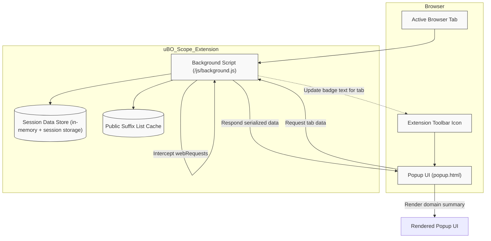

# How Does uBO Scope Work? (Architecture Diagram)

Discover the inner workings of uBO Scope through this visual, high-level architecture overview. This page explains how the extension's components collaborate to observe web requests, maintain session data, and present summarized third-party connection information in a clean, accessible UI.

---

## Overview

uBO Scope operates as a lightweight browser extension designed to transparently report all network connections your browser attempts or makes to remote servers. At its core, it consists of several key components working in harmony:

- A **background script** that listens for web requests and network events.
- A **session data store** that aggregates connection outcomes per browser tab.
- The **popup UI**, which visualizes summarized domain connection data.

This logical separation ensures efficient data collection and an intuitive user experience.

---

## Component Role and Data Flow

### 1. Background Script

- Runs continuously within the browser's extension environment.
- Uses `webRequest` listeners to monitor all relevant network requests matching the extension's host permissions (HTTP, HTTPS, WebSocket protocols).
- Categorizes each network request by outcome: allowed (successful), stealth-blocked (redirected or intercepted without obvious failure), or blocked (failed network requests).
- Extracts hostnames and domains from each request's URL to maintain aggregated counts.
- Detects new or updated top-level navigations to reset tab-specific tracking when users switch pages or tabs.

### 2. Session Data Store

- Maintains a detailed in-memory mapping keyed by tab IDs.
- Each tab's session data stores three categories of domains and hostnames mapped to counts corresponding to allowed, stealth-blocked, and blocked outcomes.
- Data includes original hostnames (for full granularity) and their corresponding effective domains (using the public suffix list to parse domain from hostname).
- Persists session data using browser session storage APIs, allowing data to survive across background script restarts within the browser session.
- Loads and caches the [Public Suffix List](https://publicsuffix.org/list/public_suffix_list.dat) to accurately determine domain boundaries.

### 3. Popup UI

- Triggered when users click the extension toolbar icon.
- Queries the background script to retrieve serialized session data for the active tab.
- Deserializes the data and presents a clear summary showing:
  - Number of connected domains
  - Details of allowed, stealth-blocked, and blocked domains
- Leverages templates for dynamically rendering domain lists with connection counts.

---

## User Interaction Flow

1. **Browsing**: As you navigate the web, uBO Scope's background script actively listens to network activity for each tab.
2. **Data Aggregation**: Connection outcomes per domain are accurately recorded and aggregated within session storage tied to each tab.
3. **Visual Feedback**: The extension icon badge updates dynamically to show a count reflecting distinct allowed third-party domains.
4. **Detailed Inspection**: Clicking the toolbar icon opens the popup, detailed with categorized domain lists and connection counts.

This workflow delivers real-time insights into your browser's remote connections without interrupting your browsing.

---

## Architecture Diagram

---

## Practical Tips & Best Practices

- **Understanding Domains vs Hostnames**: uBO Scope parses both hostnames and their effective domains using the Public Suffix List to aggregate connection counts meaningfully. This prevents overcounting subdomains.

- **Session Persistence**: Even if the browser's background service worker restarts, session data persists during your browsing session, ensuring no loss of connection history.

- **Badge Indicator**: The badge shows the number of distinct allowed third-party domains connected by the active tab, providing an at-a-glance gauge of network exposure.

- **Limitations**: Network requests not visible to the browser's `webRequest` API cannot be reported. For example, certain native integrations or proxy-level blocks might not appear.

- **Performance**: The extension batches network events to reduce performance overhead, updating UI and session data asynchronously every second.

---

## Troubleshooting Common Issues

<AccordionGroup title="Troubleshooting uBO Scope Architecture">
<Accordion title="Why is the badge count sometimes empty or not updating?">
The badge updates only if the extension has correctly recorded allowed domains for the active tab. In cases where no network requests happen or requests aren’t captured by `webRequest` listeners, the badge will be empty.

Make sure uBO Scope has proper permissions and the tab is actively generating web requests.
</Accordion>
<Accordion title="What if some domains appear blocked but I use another content blocker?">
uBO Scope relies solely on the browser’s `webRequest` API events, allowing it to see actual connection outcomes regardless of any content blocker's internal estimation. If a domain shows as blocked, it means the network request failed or was intercepted at the API level.
</Accordion>
<Accordion title="Does uBO Scope track requests in incognito or private windows?">
This depends on your browser settings and whether you allowed the extension to run in private sessions. If permissions are missing, no tracking occurs.
</Accordion>
</AccordionGroup>

---

## Summary

uBO Scope's architecture harmonizes real-time network monitoring with session persistence and user-friendly visualization. By processing raw network events in the background script, normalizing domains intelligently, and exposing rich details in the popup UI, the extension empowers users with unprecedented transparency over their browser's remote connections.

To dive deeper, follow related documentation on understanding core concepts and practical guides for making the most of uBO Scope.

---

## Additional Resources

- [What is uBO Scope?](overview/product-intro-value/what-is-uboscope)
- [Core Concepts & Terminology](overview/understanding-architecture-concepts/core-concepts-terminology)
- [Feature Overview (in the UI)](overview/understanding-architecture-concepts/quick-feature-tour)
- [Analyzing 3rd-Party Network Requests](guides/using-analyzing-connections/analyzing-3rd-party-requests)

---

<Source url="https://github.com/gorhill/uBO-Scope" paths={[{"path": "js/background.js", "range": "1-200"},{"path": "js/popup.js", "range": "1-85"}]} />