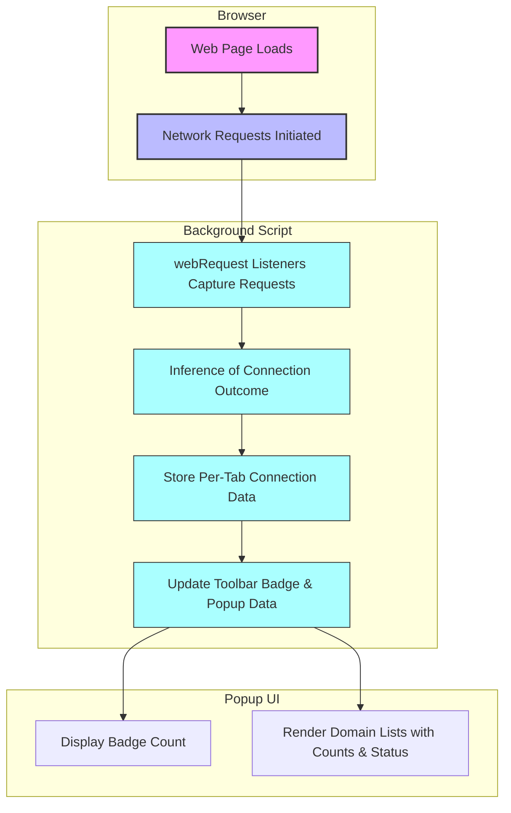

# Feature Highlights at a Glance

Discover the essential capabilities of uBO Scope that empower you to monitor and analyze all remote network connections made by your browser tabs in real time. This overview breaks down the key features that make uBO Scope uniquely effective for transparency, diagnostics, and privacy auditing.

---

## Toolbar Badge: Instant Third-Party Domain Count

- **What it shows:** The icon badge dynamically displays the count of distinct third-party remote server domains your active tab has connected to.
- **Why it matters:** By focusing on distinct domains rather than raw request counts, the badge spotlights the breadth of third-party exposure, enabling quick privacy assessment.
- **User impact:** You can immediately see if a webpage is reaching out to many unique third parties, helping you track down excessive or suspicious connections.

<Check>
The badge count reflects the number of distinct third-party domains for which there was a connection, not total requests blocked or allowed.
</Check>

---

## Popup UI: Detailed Domain-Level Connection Insights

- **Structured per-domain lists:** The popup categorizes connected domains into three clear groups:
  - **Not Blocked:** Domains from which connections succeeded.
  - **Stealth-Blocked:** Domains where connections were stealthily redirected, often by content blockers using subtle blocking techniques.
  - **Blocked:** Domains where connections were explicitly blocked or resulted in errors.
- **Count per domain:** Each domain entry shows how many times it was connected to, providing volumetric insight.
- **Unicode & Punycode support:** Domain names are displayed in their user-friendly Unicode form, with proper handling of internationalized domain names.

### Real-World Scenario
Imagine you visit a news site; the popup helps you quickly identify which advertising, analytics, or CDN servers the page is contacting — and exactly which connections were blocked or allowed — giving you precise control and understanding beyond typical ad blocker summaries.

---

## Compatibility With Any Content Blocker

- **Independent reporting:** uBO Scope listens directly to the browser's native `webRequest` API, capturing network request outcomes regardless of which content blocker or filtering approach is active.
- **Comprehensive visibility:** It reflects true connection outcomes even when DNS blocking or stealth blocking techniques are used.
- **Cross-browser support:** Compatible implementations exist for Chromium-based browsers, Firefox, and Safari, leveraging the appropriate web extension APIs.

<Info>
This means uBO Scope can complement any content blocker by providing transparent audit information on network connections, ensuring you’re fully informed.
</Info>

---

## Session-Aware Network Tracking

- **Per-tab data:** uBO Scope maintains a session mapping of all network connection outcomes per browser tab.
- **Dynamic updates:** The badge count and popup contents update as new requests are made, redirected, blocked, or succeed.
- **Persistence:** Connection data for tabs is saved and reloaded across sessions to ensure consistent reporting.

---

## User-Oriented UX and Performance Considerations

- **Responsive display:** The popup interface adapts to viewport size for optimal readability.
- **Efficient processing:** Requests are batched and processed periodically to avoid performance impact on browsing.
- **Clear visual cues:** Different background highlights indicate allowed, stealth, or blocked states for quick scanning.

---

## Summary of Core Features

| Feature                 | Benefit                                            | User Value                                          |
|-------------------------|---------------------------------------------------|----------------------------------------------------|
| Toolbar Badge           | At-a-glance exposure of third-party connections    | Immediate privacy or tracking status awareness      |
| Popup Categorized Lists | Detailed view of connection outcomes by domain    | Deep diagnostics enabling precise control          |
| Unicode Support         | Proper display of internationalized domains       | Readable domain names without confusion             |
| Compatibility           | Works alongside any content blocker and browser    | Trustworthy, independent network connection reports |
| Session Persistence     | Maintains data per tab across browsing sessions    | Consistent and continuous tracking                   |
| Efficient Processing    | Batches updates to optimize performance            | Smooth user experience without lag                   |

---

## See Also
- [Who Should Use uBO Scope?](../overview/user_journeys_usecases/target_audience) — Identify if this extension fits your needs.
- [What is uBO Scope?](../overview/intro_product_value/product_overview) — Understand the product philosophy and detailed feature breakdown.
- [Core Concepts & Terminology](../overview/core_concepts_architecture/core_concepts) — Learn key terms to interpret the data.
- [Using the Popup: Domain Lists and Details](../guides/analyzing-connections/using-popup) — Deep dive on interaction with the popup UI.

---

## Practical Tips

- Use the toolbar badge as a quick indicator: a high number could signal many third-party calls worthy of review.
- Open the popup on any active tab to investigate which domains are being connected to and their blocking status.
- Remember that stealth-blocked entries often mean connections are subtly redirected or blocked by content blockers, which may not show up in other tools.

---

## Common Pitfalls to Avoid

- **Mistake:** Using the block count displayed by other blockers as a sole privacy indicator.
  - **Why:** uBO Scope shows you actual third-party domains connected, offering a more accurate picture.
- **Mistake:** Ignoring stealth-blocked domains.
  - **Why:** These are blocked connections that evade traditional blocking notification but impact privacy.

---

This page provides a succinct but complete snapshot of uBO Scope's primary features, enabling users to understand what they can achieve quickly and why each capability matters.


---
## Code Snippet: Accessing Current Tab Data Programmatically
```javascript
// Request connection data for the currently active tab
browser.tabs.query({ active: true, currentWindow: true }).then(([tab]) => {
    if (!tab) return;
    browser.runtime.sendMessage({ what: 'getTabData', tabId: tab.id }).then(serializedData => {
        const tabData = deserialize(serializedData);
        console.log('Active Tab Data:', tabData);
    });
});
```

---

## Visual Workflow of Network Tracking & UI Update

