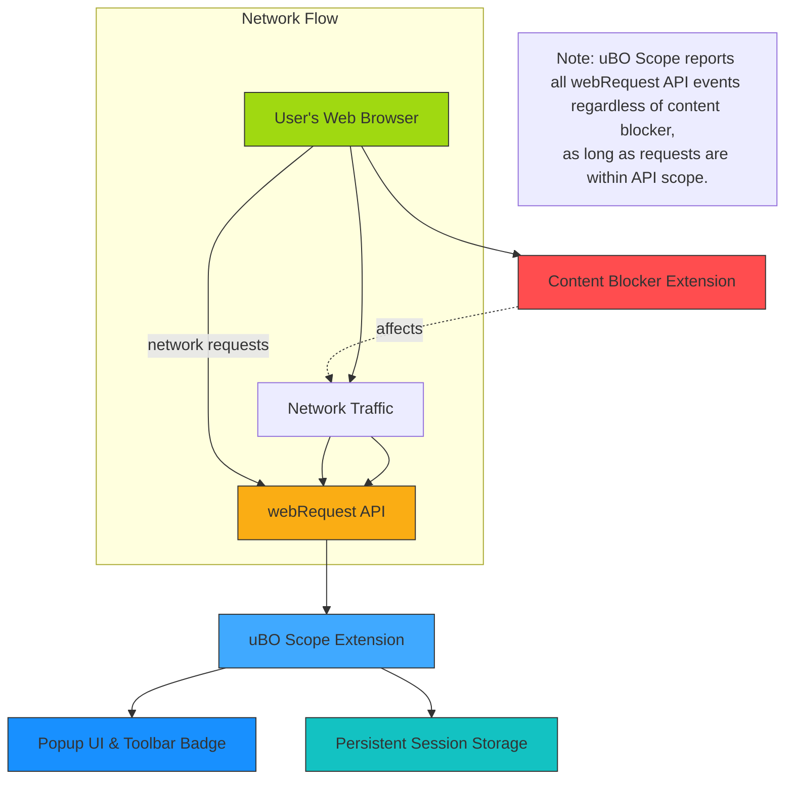

# Integration with Browsers and Other Tools

## Seamless Support Across Popular Browsers

uBO Scope is meticulously designed as a platform-agnostic browser extension, offering consistent and reliable network connection reporting across Chromium-based browsers (e.g., Google Chrome, Edge), Mozilla Firefox, and Apple Safari. This broad compatibility ensures that regardless of your browser preference, uBO Scope integrates smoothly to provide transparent insight into your web traffic.

### Browser Compatibility Highlights

- **Chromium:** Supports browsers based on Chromium Manifest Version 3, requiring minimum Chrome version 122.0.
- **Firefox:** Fully compatible with Firefox 128.0 and above, including Firefox for Android.
- **Safari:** Supports Safari version 18.5 and later, offering a seamless experience on Apple devices.

This multi-browser approach means you can maintain a consistent privacy and network monitoring workflow without being locked to a single platform.

## Platform-Agnostic Design for Consistent User Experience

By leveraging standardized browser extension APIs, uBO Scope delivers a consistent interface and functional behavior across all supported browsers. This design philosophy extends to the popup UI, toolbar badge, and the underlying network monitoring capabilities.

Whether you switch between browsers or use different devices, the extension preserves its core features, including real-time counting of third-party remote server connections, detailed domain breakdowns, and outcome categorizations (allowed, blocked, stealth). This uniformity prevents confusion and enables users to develop expertise without having to relearn the interface or interpret varying metrics.

## Complementing Other Privacy and Network Analysis Tools

uBO Scope is built to complement, not replace, existing privacy tools and network analyzers. Its primary strength lies in providing an objective, real-time view of **all** network connections initiated by browser tabs, independent of which content blocker or DNS-level filtering is active.

### How uBO Scope Enhances Your Privacy Toolkit

- **Independent of Content Blockers:** It reports connection outcomes regardless of which blocklists or blocking mechanisms you use, offering transparency into actual network behavior.
- **Cross-Tool Verification:** Use uBO Scope alongside other tools to verify claims about blocking effectiveness or to identify outliers in network behavior.
- **Filter Maintainer Support:** Particularly valuable for filter list creators or evaluators who require accurate, objective data about third-party contacts on diverse platforms.

By delivering real-time insight into network requests, uBO Scope can expose discrepancies or hidden connections that other tools might miss due to stealth blocking or unconventional filtering strategies.

## What uBO Scope Reports and Its Limitations

Understanding what uBO Scope can and cannot observe is key to correctly interpreting its data and maximizing its value.

### Reporting Coverage

- **Network Requests Within `webRequest` API Scope:** uBO Scope listens to browser network events exposed through the `webRequest` API.
- **Connection Outcomes:** It categorizes requests as allowed (successful), blocked (errors or failures), or stealth-blocked (redirected), providing detailed per-domain statistics.
- **Toolbar Badge:** Displays the count of distinct third-party domains contacted by web pages.

### Key Limitations

- **Outside API Boundaries:** Requests made **outside the reach of the `webRequest` API**, such as certain browser internal requests or network activities performed by other native applications, are not reported.
- **Browser-Dependent Reach:** The scope of `webRequest` varies between browsers and their versions. Some networking layers or optimizations may hide certain requests.
- **No Blocking Enforcement:** uBO Scope **does not block or alter network requests**; it is purely a reporting tool.

By recognizing these boundaries, users can avoid misinterpretation and appreciate uBO Scope’s role as a network transparency enhancer rather than a blocker.

## Practical Example: Using uBO Scope with Other Extensions

Imagine you use a popular content blocker extension alongside uBO Scope. Content blockers may stealthily suppress requests or modify them to evade detection by websites. uBO Scope, by capturing all `webRequest` API-reported activity, reveals the actual network interactions regardless of stealth.

This allows you to:

- Confirm which third-party domains truly loaded resources.
- Detect connections that slipped past your content blocker.
- Validate filter list performance objectively.

### Recommendations for Integration

- Use uBO Scope to **cross-check your blocker’s badge count** and verify actual network calls.
- Employ alongside network debugging tools (like browser devtools or standalone analyzers) for a deeper investigation.
- Supplement your diagnosis with uBO Scope reports when filter list maintenance or privacy audits require accurate third-party domain data.

## Summary

By supporting multiple browsers with a standardized approach, complementing other privacy tools with accurate network visibility, and clarifying its reporting scope and limitations, uBO Scope empowers users to achieve greater transparency into their web traffic while maintaining familiarity and ease of use.

---

## Additional Resources

- [Product Value and Benefits](/overview/introduction_and_principles/value_prop) — Learn why network transparency matters.
- [Core Concepts and Terminology](/overview/technical_overview/core_concepts) — Deep dive into traffic outcome categories.
- [Quick Feature Tour](/overview/technical_overview/feature_overview) — Explore essential functionalities.
- [Tracking Third-Party Server Connections](/guides/core-workflows/tracking-3rd-party-requests) — Practical usage guide.

---

## Troubleshooting & Best Practices

<Tip>
Always verify that you are running a compatible browser version as per uBO Scope’s requirements to ensure full functionality.
</Tip>

<Note>
uBO Scope relies on the browser’s `webRequest` API. If you observe missing connections or unexpected results, check for API changes or browser-specific limitations.
</Note>

<Warning>
This extension does not block connections itself. For blocking actions, use complementary content blockers configured to your preferences.
</Warning>

---

## Example Browser Support Table

| Browser         | Minimum Version | Notes                      |
|-----------------|-----------------|----------------------------|
| Chrome          | 122.0           | Chromium MV3 compliant     |
| Edge            | 122.0           | Compatible with Chromium   |
| Firefox         | 128.0           | Includes Android versions  |
| Safari          | 18.5            | macOS and iOS (limited)    |

---

## How to Confirm uBO Scope is Working in Your Browser

1. Install uBO Scope from your browser’s official extension store.
2. Navigate to any website.
3. Click the uBO Scope toolbar icon to open its popup.
4. Observe the real-time list of third-party domains contacted.
5. Cross-reference with your content blocker or network logs for validation.

This simple flow confirms integration and encourages exploration of the detailed network reports uBO Scope provides.

---

_Last updated: 2024_

---

## Source
Source code and contributions available at the [uBO Scope GitHub Repository](https://github.com/gorhill/uBO-Scope)

---

### Architecture Diagram (Simplified Integration Concept)

